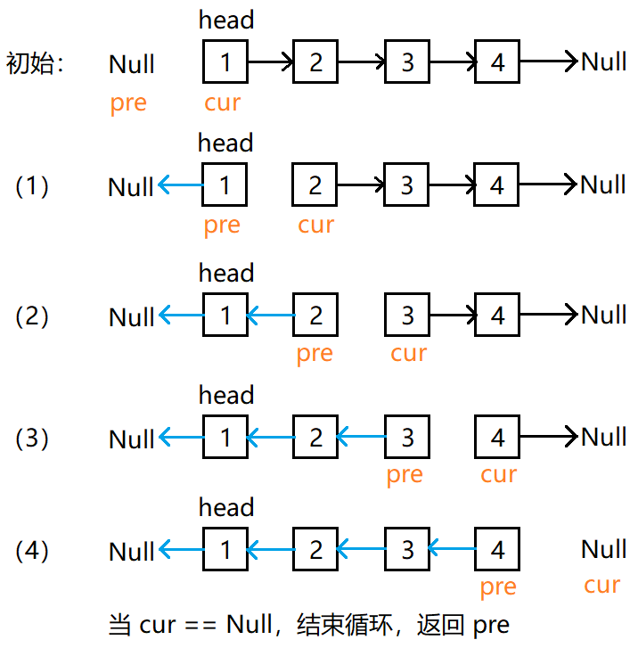
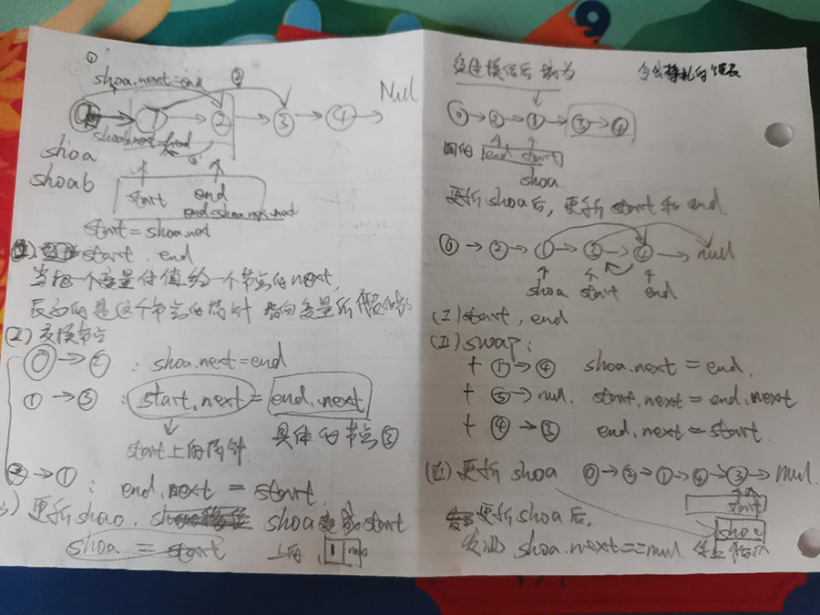
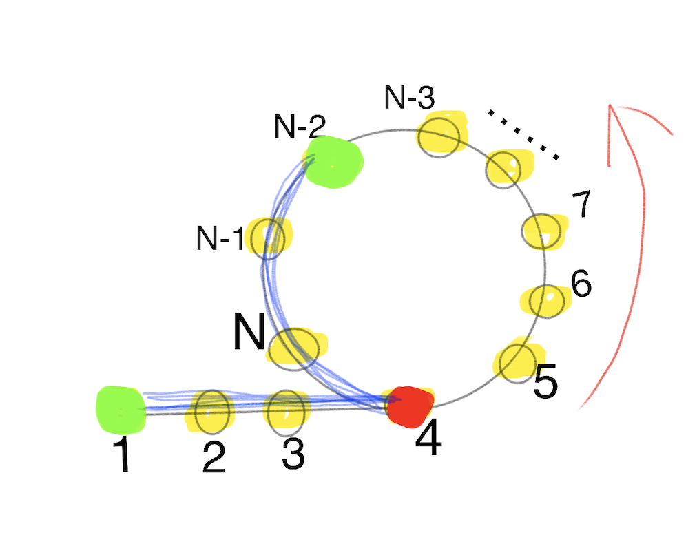
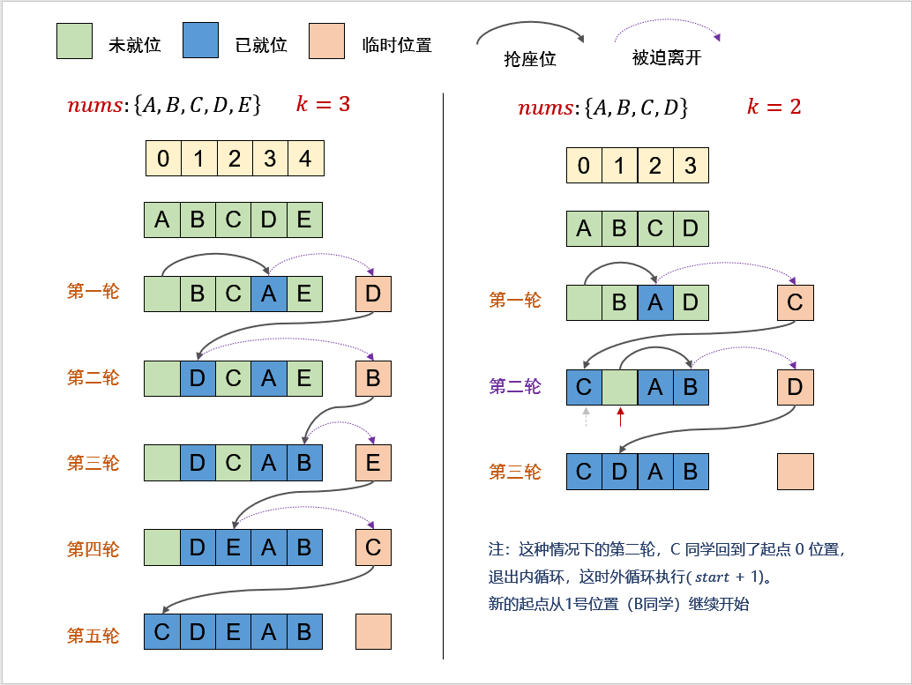

# 移动0
1. 链接: https://leetcode-cn.com/problems/move-zeroes/

2. 题目: 
+ 示例:输入: [0,1,0,3,12];  输出: [1,3,12,0,0];
  + 必须在原数组上操作，不能拷贝额外的数组。
  + 尽量减少操作次数。

3. 代码片段
```js
function moveZero(nums){
  var j = 0; //记录非0
  for(var i = 0; i < nums.length; i++){
    if(nums[i] != 0) {
      nums[j] = nums[i];
      if( i != j) {
        nums[i] = 0;
      }
      j++;
    }
  }
}
```

4. 刷题记录

|  时间   | 次数  | 
|  :----  | :----:  |
| 07.07  |   2   |
| 07.08  |   1   | 
| 07.09  |   1   | 


# 盛最多水的容器
1. 链接: https://leetcode-cn.com/problems/container-with-most-water/

2. 题目: 
(此题目很典型,比较 柱状图的最大面积)

+ 图例:
<!--  -->


图中垂直线代表输入数组 [1,8,6,2,5,4,8,3,7]。在此情况下，容器能够容纳水（表示为蓝色部分）的最大值为 49。

+ 示例：
输入：[1,8,6,2,5,4,8,3,7]
输出：49

3. 代码片段
+ 片段1:  
双循环, 这2个for一定记住
```js
 function getMaxArea(height){
   var max = 0;
   for(var i = 0; i < height.length - 1; i++){
     for(var j = i + 1; j < height.length; j++ ){
       var area = (j - i) * Math.min(height[i], height[j]);
       max = Math.max(max, area);
     }
   }
   return max;
 }
 
```
+ 片段2: 
从外向内移动低矮的柱子
```js
function getMaxArea(height){
  var max = 0; 
  for(var i = 0, j = height.length-1; i < j; ){
    var minHeight = height[i] < height[j] ? height[i++]: height[j++]; 
    var area = (j - i + 1) * minHeight; 
    max = Math.max(max, area)
  }
  return max;
}
```

4. 刷题记录

|  时间  | 次数  | 
| :---- |:----:|
| 07.07 |   2   |
| 07.08 |   1   | 
| 07.09 |   1   | 

# 爬楼梯
1. 链接: https://leetcode.com/problems/climbing-stairs/

2. 思路:
数学归纳法, 找最近重复子问题
+ 第一级台阶: 跨一阶台阶 --- 1:1
+ 第二级台阶: 1阶+1阶 或者 2阶 ---2:2种方法
+ 第三级台阶: 从第二级台阶上面跨一阶上来 或者 从第一级台阶上面跨二阶台阶上来,所以 3: f(1) + f(2) , 因为最后一步不同, 所以不会有重复 --- 3: 3种方法
+ 4: f(2) + f(3)
+ n: f(n-1) + f(n-2)  最后一步跨1个台阶的走法 + 最后一步跨2个台阶的走法
抽象为 求 斐波拉契数列

3. 代码片段
+ 片段1: 
```js
//傻傻的fibonacci
var climbStairs = function(n) {
  if(n == 1 || n == 2 ){
    return 1
  };
  return climbStairs(n-2) + climbStairs(n-1);
}
```

+ 片段2: (非常巧妙)
```js
var climbStairs = function(n){
  if(n <= 2 ){
    return n;
  }
  var f1=1, f2=2, f3=3;
  for(var i = 3; i < n+1; i++){
    f3 = f1 + f2;
    f1 = f2;
    f2 = f3;
  }
  return f3;
}
```

4. 刷题记录

|  时间   | 次数  | 
|  :----  | :----:  |
| 07.07  |   2   |
| 07.08  |   1   | 
| 07.09  |   1   | 

# [每日一练] 路径总和
1. https://leetcode-cn.com/problems/path-sum/

2. 思路:
+ 递归: 
  + 询问是否存在 从[当前节点root] 到 [叶子节点] 的路径, 满足其路径和为sum
  + 子问题: 假设从 root 到 当前节点值 之和为 val, 是否存在 从[当前节点的子节点] 到 [叶子节点] 的路径, 满足路径和为 sum-val

3. 代码片段
```js
var hasPathSum(root, sum) {
  // 终止递归的条件: 遍历到叶子节点的下一个节点, 就是当前的叶子节点没有左右子节点了
  if(root == null) return false;

  //遍历到叶子节点, 判断剩余节点是否==剩余值(变化的sum值)
  if(root.right == null && root.left == null) {
    return root.val = sum;
  }

  //递归, 不断的处理 剩余节点和需要的剩余sum
  return hasPathSum(root.left, sum-root.val) || hasPathSum(root.right, sum-root.val)
}
```
4. 刷题记录

|  时间   | 次数  | 备注  | 
| :---- | :----: | :---- |
| 07.07  |   1  |
| 07.09  |   1  | 
| 07.11  |   1  | 吃力的回忆

# 两数之和
1. https://leetcode-cn.com/problems/two-sum/
2. 示例:
给定 nums = [2, 7, 11, 15], target = 9
因为 nums[0] + nums[1] = 2 + 7 = 9
所以返回 [0, 1]

3. 代码片段
+ 暴力法: 2层循环 时间复杂度: O(n^2)
```js
  var twoSum = function(nums, target){
    var res = new Array(2);
    for(var i = 0; i < nums.length - 1; i++) {
      for(var j = i+1; j < nums.length; j++) {
          if(nums[i] + nums[j] == target){
            res[0] = i;
            res[1] = j;
            return res;
          }
      }
    }
    return new Array(0)
  }
```
+  map 方法: {key:value}, 推荐
```js
  var twoSum = function (nums, target) {
    var tmpMap = {}; //用于存储剩余值的map,其实就是一个对象
    //在tmpMap中的key=target-当前值, 则返回当前值的index和tmpMap中这个值的index
    //如果没有找到, 则添加 当前值 到tmpMap中
    for(var i = 0; i < nums.length; i++){
      var cur = nums[i];
      if(tmpMap[target-cur] !== undefined){
        return [tmpMap[target-cur], i]; 
      }
      tmpMap[cur] = i; //map中的值是 索引
    }
  }
```

4. 刷题记录

|  时间   | 次数  | 备注|
|  :----  | :----: | :----|
| 07.08  |   1  | 暴力法|
| 07.09  |   1  | 暴力法|
| 07.09  |   1  | Map法|
| 07.11  |   2  | Map法|

# 三数之和
1. https://leetcode-cn.com/problems/3sum/
2. 题目:
+ 给你一个包含 n 个整数的数组 nums，判断 nums 中是否存在三个元素 a，b，c ，使得 a + b + c = 0 ？请你找出所有满足条件且不重复的三元组。
注意：答案中不可以包含重复的三元组。

+ 示例：
```js
  // 给定数组 nums = [-1, 0, 1, 2, -1, -4]，
  // 满足要求的三元组集合为：
  [
    [-1, 0, 1],
    [-1, -1, 2]
  ]
```

3. 代码片段
+ 代码1: 暴力: 三层for循环 + 去重(去重是个麻烦事>>>)

+ 代码2: (非常精妙的方法) 排序+双指针, 参考 [题解] 中 关于 [排序+双指针] 的画图解法
+ 思路: 
  + 数组排序. 
  + 遍历排序后的数组. 
将遍历的每个nums[i]作为固定值, 使用左右指针指向nums[i]后面的两端, 为nums[L]和nums[R]
L = i+1; R = length-1; 
计算三个数的和sum,判断是否为0, 满足则添加进结果集
  + 如果 nums[i] > 0, 则三数之后无法等于0, 结束循环
  + 如果 nums[i] == nums[i-1], 数字重复, 会导致结果重复, 所以跳过
  + 当 sum===0, nums[L]==nums[L+1], 结果重复, 跳过, L++
  + 当 sum===0, nums[R]==nums[R-1], 结果重复, 跳过, R--

```js
//参考threeSum.html
var threeSum = function (nums) {
  if(nums == null || len < 3) return res;

  nums.sort((a, b) => a-b);

  for(var i = 0; i < len; i++){
    if(nums[i]>0) break;
    nums[i] = nums[i-1] continue;
    left, right, sum;
    while(left < right) {
      if(sum == 0) {
        ....
      }else if(sum < 0) {
        ....
      }else if(sum > 0){

      }
    }
  }


}

```
+ 回忆套路
```js
// 1. 不符合条件的 nums==null || nums.length <3
// 2. 排序
// 3. 循环遍历
    // - 排序后先排除不合实际的 num[i]>0 break
    // - nums[i] 去重
    //while(left<right){
      // - sum == 0
      // - sum>0
      // - sum<0
    // }

```

4. 刷题记录

|  时间   | 次数  | 备注|
|  :----  | :----: | :----|
| 07.08  |   1  | 暴力法|
| 07.09  |   2  | 双指针, 学习|
| 07.11  |   1  | 双指针,不是太吃力的回忆, while(left < reight) |

# [每日一练]-跳水板
1. 链接: https://leetcode-cn.com/problems/diving-board-lcci/
2. 示例:
+ 输入：shorter = 1, longer = 2, k = 3(3块木板)
+ 输出： 可能有的木板长度, {3,4,5,6}, 返回的长度需要从小到大排列。

3. 代码片段
思路:
+ 考虑边界: 
  - 没有板子, k=0
  - shorter = longer 
+ 总共k块板子, 有i块shorter, 那么就有(k-i)块longer, 题目要求 从小到大排序
 
```js
var divingBoard = function(shorter, longer, k) {
  if(k == 0) {
    return [];
  }
  if(shorter === longer ){
    return [k * shorter]
  }
  const res = [];
  for(let i=0; i<= k; i++){
    res.push(shorter * k + (longer- shorter) * i)
  }
  return res;
}
```

4. 刷题记录

|  时间   | 次数  | 备注|
| :---- |:----:|:----:|
| 07.08  |   1  |
| 07.09  |   1  |
| 07.11  |   1  |不要忘记i=k的情况 , i<=k


# 反转链表
1. https://leetcode-cn.com/problems/fan-zhuan-lian-biao-lcof/

2. 解题思路：
要将链表 1 -> 2 -> 3 -> 4 -> Null 反转为 4 -> 3 -> 2 -> 1 -> Null ，需要一个 cur 指针表示当前遍历到的节点；一个 pre 指针表示当前节点的前驱节点；在循环中还需要一个中间变量 temp 来保存当前节点的后驱节点。

3. 算法流程：
+ 首先 pre 指针指向 Null，cur 指针指向 head；
+ 当 cur != Null，执行循环。
  + 先将 cur.next 保存在 temp 中防止链表丢失：temp = cur.next
  + 接着把 cur.next 指向前驱节点 pre：cur.next = pre
  + 然后将 pre 往后移一位也就是移到当前 cur 的位置：pre = cur
  + 最后把 cur 也往后移一位也就是 temp 的位置：cur = temp
  + 当 cur == Null，结束循环，返回 pre。

4. 图解流程：
<!--  -->


3. 代码片段
+ 自己画图, 理解. 2个滑动的指针, 一个临时指针
+ 将该指针指向哪里, 就是x.next = 哪里
+ 面包写法: 初始化变量, while循环, 返回变量
```js
  var reverseList = function(head) {
    var pre = null, cur = head, temp;
    while(cur != null) {
      //直到pre走到原链表的末尾(反转链表的头), cur移动到了null,就完成链表的翻转
      //1.暂存指向下一位的指针,方便cur可以找到
      temp = cur.next;
      //2. 局部小反转, 指向下一位的指针 反向指向前面(pre)
      cur.next = pre;
      //3. pre移动到cur
      pre = cur;
      //4. cur移动到下一位(就是开始暂存的指针)
      cur = temp;
    }
    return pre; //返回指向新链表的头的指针, 这个链表已经实现反转
  }
```
4. 刷题记录

|  时间   | 次数  | 
|  :----  | :----:  |
| 07.09  |   1  |
| 07.10  |   1  | 

# 两两交换链表中的节点
1. https://leetcode-cn.com/problems/swap-nodes-in-pairs/
2. 题目: 
+ 示例: 给定 1->2->3->4, 你应该返回 2->1->4->3.

3. 思路: 
+ 迭代法: 
在链表的最前面添加一个哨兵(是个节点, 有next指针), 将每个节点想象为一个哨所
每相邻的2个哨所相互交换, 交换一次, 哨兵就会移动到这2点的前一位(比如0, 1),直到 哨兵next指向null, 结束循环, 就返回哨兵中next指针指向的链表



4. 代码流程: 
+ 创建2个哨兵:
  + 一个哨兵负责指向链表(交换之前和交换之后的链表都是又他指向)
  + 另一个哨兵是移动的, 交换一次后, 哨兵移动一个
+ 新建一个哨兵节点 shaob: val=0, next=head
+ 从这个shaob复制一个可以移动的哨兵节点 shao
+ 初始化 start, end
+ 改变指针指向
  + 0 -> 2
  + 1 -> 3
  + 2 -> 1
+  更新 节点shao (val, next)

5. 刷题记录 ( 有点难,花了1天才理解)
|  时间   | 次数  | 
|  :----  | :----:  |
| 07.10  |   1  | 

# 环形链表
1. https://leetcode-cn.com/problems/linked-list-cycle/submissions/
2. 寻找相遇点的位置(在链表中的Index)
3. 思路: 

联想: 乌龟和兔子 


5. 刷题记录
|  时间   | 次数  | 
|  :----  | :----:  |
| 07.10  |   1  | 

# 环形链表II
1. https://leetcode-cn.com/problems/linked-list-cycle-ii/
2. 思路: 
+ 龟兔赛跑
  - 找到[相遇点], 2倍速快跑和1倍速慢跑, 直到相遇(相遇点) [fast == slow]
  - 2只速度相同的乌龟, 分别从[起始点]->[入环点], 从[相遇点]-> [入环点]
虽然不知道具体的距离是多少, 但是当他们相遇的时候, 就是 [入环点]


<!--  -->


5. 刷题记录 :

|  时间   | 次数  | 
|  :----  | :----:  |
| 07.10  |   1  | 

***
令我感到挣扎的链表, 07.10日做了这几个链表的题目, 主要是节点的next指针的指向, 需要多加练习
该节点指向节点a, 表示 x.next = a; 
***

# 有效的括号
1. https://leetcode-cn.com/problems/valid-parentheses/
2. 思路: 入栈
+ len%2 !=0, return false, 一定是偶数个符合
+ 遇到左括号, 一律入栈
+ 遇到右括号, 将栈顶元素拿出,与右括号做比较
  + 如果不匹配则返回false(说明不是有效的括号)
  + 如果匹配, 则继续循环

3. 代码片段:

4. 刷题记录 :

|  时间   | 次数  | 
|  :----  | :----:  |
| 07.10  |   1  | 

# 柱状图中最大的矩形(栈的想法不太容易)
1. https://leetcode-cn.com/problems/largest-rectangle-in-histogram/

2. 思路: 
+ 暴力法: 意思遍历柱形高度, 对于每一个高度分别向两边扩散, 求出以当前高度为矩形的最大宽度多少。
<!--  -->


+ 流程: 
  + 遍历每个柱子, 当前柱子 heights[i] 的高度不变,获取当前高度下, 最大宽度
  + 以当前的柱子向左找, 找到高度比其小的, 继续向左找, 直到找到高度比当前大的 
  + 以当前的柱子向右找, 找到高度比其小的, 继续向右找, 直到找到高度比当前大的 
  + 高度*最大宽度
+ 分治法: 略懂
+ 单调栈: 完全没有懂

4. 刷题记录:

|  时间   | 次数  | 备注|
| :----  | :----: |:----: | 
| 07.10  |   1  | 定高,找最大宽, 暴力|

# 旋转数组
1. https://leetcode-cn.com/problems/rotate-array/
2. 思路:
3. 代码片段
+  暴力法
+  %运算(巧妙)
+  环状替换(实在是很难想到), 觉得自己很傻[越学越傻]

<!--  -->


4. 刷题记录:

|  时间   | 次数  | 备注 |
| :---- | :----:|:----:|
| 07.10  |   1  | 暴力法|
| 07.10  |   1  | %运算 |

# 加1
1. https://leetcode-cn.com/problems/plus-one/

2. 刷题记录

|  时间   | 次数  | 
|  :----  | :----:  |
| 07.10  |   1  | 


# 有效的山脉数组 [老师推荐, 比较常见的简单题目]
1. https://leetcode-cn.com/problems/valid-mountain-array/

2. 思路
+ 线性扫描: while()
  + 直到找到第一个不满足 A[i] < A[i+1] 的 i, 这个i 就是数组的最高点的位置. 
  + 如果i==0 || 不存在这样的i (整个数组都是单调递增的), return false
  + 否则从i 开始继续扫描, 判断接下来的 是否满足 A[i] > A[i+1] , 如果都满足, 则return true,否则返回false

+ 从两边分别扫描 (精妙)

3. 代码片段: 
双指针, 从数组两边扫描
```js
var validMountainArray = function (A) {
  if(A.length < 3) return false;
  let left = 0;
  let right = A.length - 1;
  while(left < A.length -2 && A[left] < A[left+1] ) {
    left++;
  }
  while(right > 1 && A[right] < A[right -1]) {
    right--;
  }
  return left === right;
}
```
4. 刷题记录

|  时间   | 次数  | 
|  :----  | :----:  |
| 07.11  |   1  | 

# 315. 计算右侧小于当前元素的个数 [每日一题]
1. https://leetcode-cn.com/problems/count-of-smaller-numbers-after-self/
2. 示例:
+ 输入: [5,2,6,1], 输出: [2,1,1,0] 
+ 解释:
  - 5 的右侧有 2 个更小的元素 (2 和 1).
  - 2 的右侧仅有 1 个更小的元素 (1).
  - 6 的右侧有 1 个更小的元素 (1).
  - 1 的右侧有 0 个更小的元素.

3. 思路
+ 暴力法(很容易想到): 816ms运行时间
+ 归并排序(后续学习)

4. 刷题记录

|  时间   | 次数  | 备注|
|  :----  | :----:|:----|
| 07.11  |   1  | 暴力法|

# 26. 删除排序数组中的重复项
1. https://leetcode-cn.com/problems/remove-duplicates-from-sorted-array/

2. 题目: 
不要使用额外的数组空间，你必须在 原地 修改输入数组 并在使用 O(1) 额外空间的条件下完成。

3. 思路:
+ hashMap : 设定一个对象, 唯一的key值 (有误, 不应该使用额外的新数组)
+ 双指针

4. 刷题记录

|  时间   | 次数  | 备注|
|  :----  | :----:|:----|
| 07.11  |   1  | 双指针|

# 21. 合并两个有序链表
1. https://leetcode-cn.com/problems/merge-two-sorted-lists/

2. 示例:
两个升序链表合并为一个新的 升序 链表并返回: 
+ 输入：1->2->4, 1->3->4
+ 输出：1->1->2->3->4->4

3. 代码片段
+ 递归:
```js
var mergeTwoLists = function(l1, l2) {
 if (l1 === null) {
        return l2;
    } else if (l2 === null) {
        return l1;
    } else if (l1.val < l2.val) {
        l1.next = mergeTwoLists(l1.next, l2);
        return l1;
    } else {
        l2.next = mergeTwoLists(l1, l2.next);
        return l2;
    }
    
};
```
4. 刷题记录

|  时间   | 次数  | 备注|
|  :----  | :----:|:----|
| 07.11  |   1  | 递归 |


# 88. 合并两个有序数组
1. https://leetcode-cn.com/problems/merge-sorted-array/
2. 题目:
将 nums2 合并到 nums1 中，使 nums1 成为一个有序数组。
示例:
 + 输入: nums1 = [1,2,3,0,0,0], m = 3 ; nums2 = [2,5,6],n = 3
 + 输出: [1,2,2,3,5,6]

3. 思路:
+ 从后向前遍历: (参考 题解中的画图)
两个数组都已经排序(从小到大), 给每个数组添加一个可以滑动的指针, 指向数组的最后一位.扩大数组nums1的容量.(指向扩大容量后的指针) 比较两个指针指向的数字. 谁大, 就把大的值放入nums1的后面, 并移动指针. 另外的指针不动. 直到指针引出(没有值), 这个时候, nums2中剩余的就是小的数字(已经排序的), 最后将其一起添加到nums1的前面.
 + 2个移动的指针(分别指向数组的最后一位), len1, len2
 + nums1扩容 , 指向扩容后数组最后一位的指针(第三个指针 len)
 + 从最后一位开始, 比较值的大小. 把大的值放入len指向的位置, 指向大值的指针移动
 + 直到比较到len1或len2位置上没有值, 说明比较结束
 + 把nums2上剩余的这些小值, 都一起放入到nums空出的前面的位置
+ 简单说: 就是3个指针, 从最后一位开始遍历比较, 谁大谁动, 一锅端

3. 代码片段
```jsx
 var merge = function(nums1, m, nums2, n) {
    var len1 = m -1;
    var len2 = n-1;
    var len = m + n -1;
    while( len1 >= 0 && len2 >= 0) {
        nums1[len--] = nums1[len1] > nums2[len2] ? nums1[len1--] : nums2[len2--];
    }

    function arrayCopy(src, srcIndex, dest, destIndex, length) {
        // dest.splice(destStart, srclen, destList)
        dest.splice(destIndex, length, ...src.slice(srcIndex, srcIndex+length))
    }
    arrayCopy(nums2, 0, nums1, 0, len2+1);

};
```

4. 刷题记录:

|  时间   | 次数  | 备注|
|  :----  | :----:|:----|
| 07.11  |   1  | 从后向前遍历 |
| 07.12  |   1  | 从后向前遍历 |

 # 239. 滑动窗口最大值
1. https://leetcode-cn.com/problems/sliding-window-maximum/solution/239-hua-dong-chuang-kou-zui-da-zhi-by-alexer-660/

2. 思路
+ 暴力法 , 真的是相当慢, 3572ms
+ 滑动窗口+ 双端队列 (推荐, 但还不理解)

# 641. 设计循环双端队列
1. https://leetcode-cn.com/problems/design-circular-deque/
2. todo 

# 42. 接雨水
1. https://leetcode-cn.com/problems/trapping-rain-water/
2. 思路
3. todo(有点晕)

