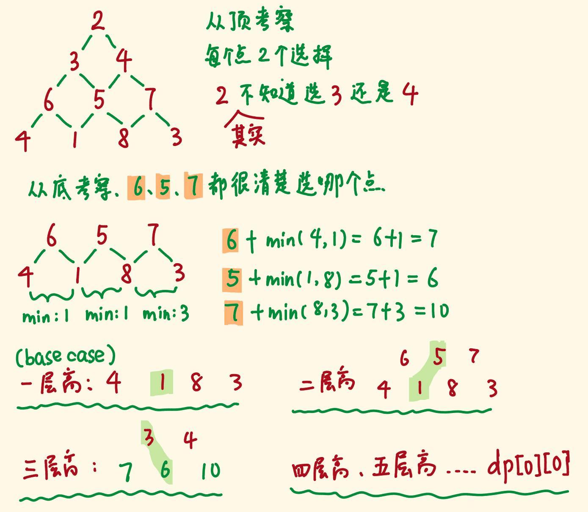

# 350. 两个数组的交集||
1. https://leetcode-cn.com/problems/intersection-of-two-arrays-ii/
2. 求两个数组的交集
+ 示例1: 
```
输入: nums1 = [1,2,2,1], nums2 = [2,2]
输出: [2,2]
```
+ 示例2: 
```
输入: nums1 = [4,9,5], nums2 = [9,4,9,8,4]
输出: [4,9]
```

3. 思路
+ Hashmap:
  - 遍历数组1, 将每个值和其出现的次数放入Hashmap中. Map[key(元素值): val(出现的次数)]
  - 再遍历第二个数组, 如果找到对应元素, 则添加这个元素到返回数组里
  - 如果value值>1, HashMap中的value值减1, 表示已经找到一个相同的值
  - 如果value值=1, 则删除该元素

+ 排序+双指针
  - 分别排序
  - 设定2个为0的指针, 比价2个指针的元素是否相等
  - 如果相等, 元素push到返回值里, 2个指针同时往前移动
  - 如果不相等, 元素小的指针右移一位
  - 当至少有一个指针超出数组范围时, 遍历结束

4. 刷题记录:

|  时间   | 次数  | 备注  | 
| :---- | :----: | :---- |
| 07.13  |   1  | Hashmap
| 07.13  |   1  | 排序+双指针

# 242.有效的字母异位词
1. https://leetcode-cn.com/problems/valid-anagram/description/
2. 题目:
+ 字母异位词指字母相同，但排列不同的字符串。
+ 示例1
```
输入: s = "anagram", t = "nagaram"
输出: true
```
+ 示例2
```
输入: s = "rat", t = "car"
输出: false
```
3. 思路:
+ 排序:

+ hashMap


4. 刷题记录

|  时间   | 次数  | 备注  | 
| :---- | :----: | :---- |
| 07.13  |   1  | 排序,暴力
| 07.13  |   1  | Hashmap, 统计出现的次数

# 49.字母异位词分组
1. https://leetcode-cn.com/problems/group-anagrams/
2. 题目:
+ 示例
```
输入: ["eat", "tea", "tan", "ate", "nat", "bat"]
输出:
[
  ["ate","eat","tea"],
  ["nat","tan"],
  ["bat"]
]
```

3. 思路:
+ hashMap (字符串): 
  > 
  + 遍历数组, 对每个字符串排序, 如果是字母异位词, 则相同
+ hashMap (数字): 
  + ("abb" 就映射到了 "1#2#0#0#0")
+ 

4. 刷题记录

|  时间   | 次数  | 备注  | 
| :---- | :----: | :---- |
| 07.13  |   1  | Hashmap
| 07.13  |   1  | Hashmap

# 94.二叉树的中序遍历
1. https://leetcode-cn.com/problems/binary-tree-inorder-traversal/
2. 题目: 
```
输入: [1,null,2,3]
   1
    \
     2
    /
   3

输出: [1,3,2]
```

3. 代码片段
+ 递归
+ 迭代 (栈)

4. 刷题记录

|  时间   | 次数  | 备注  | 
| :---- | :----: | :---- |
| 07.13  |   1  | Hashmap
| xxxxx  |   1  | 

# 144.二叉树前序遍历
1. https://leetcode-cn.com/problems/binary-tree-preorder-traversal/
2. 题目: 
```
输入: [1,null,2,3]  
   1
    \
     2
    /
   3 

输出: [1,2,3]
```

4. 刷题记录

|  时间   | 次数  | 备注  | 
| :---- | :----: | :---- |
| 07.13  |   1  | Hashmap
| xxxxx  |   1  | 

# 120.三角形最小路径和 [每日一题]
1. https://leetcode-cn.com/problems/triangle/
2. 题目: 
+ 具体: 给定一个三角形，找出自顶向下的最小路径和。每一步只能移动到下一行中相邻的结点上。 
+ 相邻的结点:  在这里指的是 下标 与 上一层结点下标 相同或者等于 上一层结点下标 + 1 的两个结点。 
+ 示例:
```
[
     [2],
    [3,4],
   [6,5,7],
  [4,1,8,3]
]
```
+ 自顶向下的最小路径和为 11（即，2 + 3 + 5 + 1 = 11）

3. 知识:
+ 在本题中，给定的三角形的行数为 n，并且第 i 行（从 0 开始编号）包含了 i+1 个数。如果将每一行的左端对齐，那么会形成一个等腰直角三角形，如下所示：
```
[2]
[3,4]
[6,5,7]
[4,1,8,3]
```

3. 动态规划:

+ f[i][j] : 从三角形顶部走到位置(i, j)的最小路径和. 这里的位置(i, j) 指的是 三角形中 第i行第j列(均从0开始编号)的位置
+ 由于每一步只能移动到下一行「相邻的节点」上，因此要想走到位置 (i, j)(i,j)，上一步就只能在位置 (i - 1, j - 1)(i−1,j−1) 或者位置 (i - 1, j)(i−1,j)。我们在这两个位置中选择一个路径和较小的来进行转移，状态转移方程为：

```
f[i][j] = min(f[i−1][j−1],f[i−1][j])+c[i][j] 
```
其中 c[i][j]c[i][j] 表示位置 (i, j)(i,j) 对应的元素值。

+ 注意第 i 行有 i+1 个元素，它们对应的 j 的范围为 [0, i]。
当 j=0 或 j=i 时，上述状态转移方程中有一些项是没有意义的。
 - 例如当 j=0 时，f[i-1][j-1] 没有意义，因此状态转移方程为：
    ```
    f[i][0] = f[i-1][0] + c[i][0]
    ```
    即当我们在第 i 行的最左侧时，我们只能从第 i-1 行的最左侧移动过来。

  - 当 j=i 时，f[i-1][j] 没有意义，因此状态转移方程为：
    ```
    f[i][i] = f[i−1][i−1] + c[i][i]
    ```
    即当我们在第 i 行的最右侧时，我们只能从第 i-1 行的最右侧移动过来

+ 最终的答案即为 f[n-1][0] 到 f[n-1][n-1] 中的最小值，其中 n  是三角形的行数。

+ 细节 : 状态转移方程的边界条件是什么？
  - 由于我们已经去除了所有「没有意义」的状态，因此边界条件可以定为：
    ```
    f[0][0] = c[0][0]
    ```
  - 即在三角形的顶部时，最小路径和就等于对应位置的元素值。
  - 这样一来，我们从 1 开始递增地枚举 i，并在 [0, i] 的范围内递增地枚举 j，就可以完成所有状态的计算。

+ 状态转移：
```
dp[i][j] 
= min(dp[i + 1][j], dp[i + 1][j + 1]) + triangle[i][j]dp[i][j]
= min(dp[i+1][j], dp[i+1][j+1]) + triangle[i][j]
```


3. 代码片段
+ 动态规划: 自顶向下:

+ 动态规划: 自底向上:




```js
/**
 * @param {number[][]} triangle
 * @return {number}
 */
var minimumTotal = function(triangle) {
  for(let i = triangle.length - 2; i>=0; i--){
    for(let j=0; j < triangle[i].length; j++){
      triangle[i][j] = Math.min(triangle[i+1][j], triangle[i+1][j+1]) + triangle[i][j];
    }
  }
  return triangle[0][0];
}
```
+ 背下来
自己的值 = 临近值中的小值  + 自己
```jsx
//from buttom to up, 二维数组 triangle[i][j]
  for(let i = triangle.length-2; i > 0 ; i--) {
    for(let j = 0 ; j < triangle[i].length; j++) {
      triangle[i][j] = Math.min(triangle[i+1][j], triangle[i+1][j+1]) + triangle[i][j]; 
    }
  }
  return triangle[0][0]
```

4. 刷题记录

|  时间   | 次数  | 备注  | 
| :---- | :----: | :---- |
| 07.14  |   1  | 动态规划
|  07.14  |   1  | 

<script type="text/javascript" src="http://cdn.mathjax.org/mathjax/latest/MathJax.js?config=default"></script>

# 96.不同的二叉搜索树 [每日一题]
1. https://leetcode-cn.com/problems/unique-binary-search-trees/

2. 知识: 
+ 假设n个节点存在二叉排序树的个数是G(n)，令f(i)为以i为根的二叉搜索树的个数，则
```
G(n) = f(1) + f(2) + f(3) + f(4) + ... + f(n)
```
+ 当i为根节点时，其左子树节点个数为i-1个，右子树节点为n-i，则
```
f(i) = G(i-1)*G(n-i)
```
+ 综合两个公式可以得到 <u>卡特兰数</u> 公式
```
G(n) = G(0)*G(n-1) + G(1)*(n-2) + ...+ G(n-1)*G(0)
```
+ 图解:


2. 思路: 
+ 动态规划
  
+ [卡特兰数] 公式: 
  + $$ \sum_{i=1}^{n}G(n) = G(i - 1) \cdot G(n-i) $$
  ```
  G(0) = 1; //一个节点
  G(1) = 1; //一个节点
  G(2)= G(0)*G(1)+ G(1)*G(0);// 2种情况
  G(3)= G(0)*G(2)+G(1)*G(1)+ G(2)*G(0)
  ...
  G(n)= G(0)*G(n-1)+ G(1)*G(n-2)+...+G(n-1)*G(0)
    i: 2 ~ n
    j: 与i的大小有关, 1~ i
  ```
3. 代码片段
```js
var numTrees = function(n) {
  const G = new Array(n+1).fill(0);
  G[1] = 1;
  G[0] = 0;

  for(let i = 2; i <= n; i++) {
    for(let j = 1; j<= i; j++){
      //G[2] = G[0]*G[1];
      //G[3] = G[0]*G[2]+G[1]*G[1]+G[2]*G[0]
      // G[i] = Sum(G[j-1]*G[i-j])
      G[i] += G[j-1] * G[i-j];
    }
  }
  return G[n];
}

```

+ 背下来
```js
 i: 2 to n
 j: 1 to i
 G[i] += G[j-1] * G[i-j]
 //[i-j] [j-1]
 return G[n]

```

4. 刷题记录

|  时间   | 次数  | 备注  | 
| :---- | :----: | :---- |
| 07.15  |   1  | 动态规划
| 07.15  |   1  | 


# 35.搜索插入位置[每日一题][二分查找]

1. https://leetcode-cn.com/problems/search-insert-position/

2. 推荐题目讲解: https://liweiwei1419.gitee.io/leetcode-algo/2019/06/17/leetcode-solution-new/search-insert-position/

3. 题目:
+ 给定一个排序数组和一个目标值，在数组中找到目标值，并返回其索引。
+ 如果目标值不存在于数组中，返回它将会被按顺序插入的位置。
+ 你可以假设数组中无重复元素。

4. 示例:
```
输入: [1,3,5,6], 5
输出: 2

输入: [1,3,5,6], 2
输出: 1;

输入: [1,3,5,6], 0
输出: 0
```

5. 思路:

6. 刷题记录

|  时间   | 次数  | 备注  | 
| :---- | :----: | :---- |
| 07.16  |   1  | 二分查找
| 07.17  |   1  | 

**** heap ****

# 40.最小的k个数 [大顶堆]

1. https://leetcode-cn.com/problems/zui-xiao-de-kge-shu-lcof/

2. 题目:
+ 输入整数数组 arr ，找出其中最小的 k 个数。
+ 例如，输入 4、5、1、6、2、7、3、8 这8个数字，则最小的4个数字是 1、2、3、4。
+ 示例:
```
输入：arr = [3,2,1], k = 2
输出：[1,2] 或者 [2,1];

输入：arr = [0,1,2,1], k = 1
输出：[0]
```

3. 思路:
+ 排序:
+ 堆 :
  + 大小为 k 的最大堆（大顶堆），将数组中的元素依次入堆，当堆的大小超过 k 时，便将多出的元素从堆顶弹出。
  + 我们以数组 [5, 4, 1, 3, 6, 2, 9]， k=3 为例展示元素入堆的过程，如下面动图所示
  


4. 代码片段: 
+ 排序
```js
var getLeastNumbers = function(arr, k) {
  //排序
  return arr.sort((a, b) => a-b).slice(0, k)
};
```

+ 最小堆:


5. 刷题记录

|  时间   | 次数  | 备注  | 
| :---- | :----: | :---- |
| 07.16  |   1  | 最小堆


# 347. 前 K 个高频元素 [小顶堆]
1. https://leetcode-cn.com/problems/top-k-frequent-elements/
2. 题目:给定一个非空的整数数组，返回其中出现频率前 k 高的元素。
3. 示例:
```
输入: nums = [1,1,1,2,2,3], k = 2
输出: [1,2]

输入: nums = [1], k = 1
输出: [1]
```

4. 思路: 
+ map , 时间复杂度 O(nlogn)
+ map + 小顶堆
	+ 使用小顶对:  假设你手里有 k 个候选的最大数，如果再给你一个新的数，你比较之后应该丢掉这 k + 1 个数中“最小的数”，既然要操作“最小的数”那自然要用小根堆;
  - js 写个小顶堆 (insert, delete)
  - 统计每个元素的频率 map = {key(元素值) : value(该元素出现的频率)}
  - [前k个数] - 小顶堆
  - 从 k 位开始遍历map(map数组中去掉小顶堆而余下的数字), 每个数据出现的频率都和小顶堆的堆顶元素比较.
    - 小于 heap,不处理
    - 大于 heap, 这个元素 替换heap. 
    - 继续 heapify 小顶堆
+ 遍历结束后, 这k个数据就是结果. 因为小的值都被踢出这个堆了 

+ 桶排序( todo)

5. 刷题记录

|  时间   | 次数  | 备注  | 
| :---- | :----: | :---- |
| 07.16  |   1  | map
| 07.17  |   1  | 小顶堆

# 49.丑数 [最小堆]
1. https://leetcode-cn.com/problems/chou-shu-lcof/

2. 题目: 
我们把只包含质因子 2、3 和 5 的数称作丑数（Ugly Number）。求按从小到大的顺序的第 n 个丑数。

3. 示例:
```
输入: n = 10
输出: 12
解释: 1, 2, 3, 4, 5, 6, 8, 9, 10, 12 是前 10 个丑数。
```
4. 思路:
+ 丑数的递推性质： 丑数只包含因子 2, 3, 5;
因此有 “丑数 == 某较小丑数 * 某因子” （例如：10 = 5×2）;
+ 因为丑数只包含质因数 2, 3, 5，所以对于下个丑数来说，一定是前面某个丑数乘 3、乘 4 或者乘 5 所得。准备三个指针 ptr2、ptr3、ptr5，它们指向的数只能乘 2、3 和 5。在循环过程中，每次选取 2 * res[ptr2]、3 * res[ptr3] 和 5 * res[ptr5]这三个数中结果最小的数，并且将对应的指针向前移动。有效循环是 n 次，当循环结束后，res 数组中就按从小到大的顺序保存了丑数。


+ 小顶堆: 可以在 O(LogN)O(LogN) 时间复杂度内找到当前最小的元素。整体算法流程是：
  + 准备最小堆 heap。准备 map，用于记录丑数是否出现过。
  + 将 1 放入堆中
  + 从 0 开始，遍历 n 次：
    - 取出堆顶元素，放入数组 res 中
    - 用堆顶元素依此乘以 2、3、5
    - 检查结果是否出现过。若没有出现过，那么放入堆中，更新 map
  + 返回 res 最后一个数字


# 62.不同路径 [动态规划][经典呀]
1. https://leetcode-cn.com/problems/unique-paths/
2. 思路:
+ 动态规划:
+ 
+ 
+ 说明:
  - 在左边的图里，每个位置上的数字代表了到该点的路径数量。
  - 显然第一列为1，第一行为1.因为仅仅在一行或者一列中移动 只有一种路径.
  - 每个位置可以由它上方或者由它左方到达。
  - 每个位置上的值，也就是该位置的路径数目 = 其上方数字 + 其左方数字
  - 观察这个二维矩阵的规律，不难发现可以在一维数组中进行更新迭代完成。
  - 使用一个vector进行更新就行。更新过程为：vec[i] = vec[i-1] + vec[i]

3. 代码:
```js
/**
 * @param {number} m
 * @param {number} n
 * @return {number}
 */
var uniquePaths = function(m, n) {
    var cur = new Array(n).fill(1);
    for(var i = 1;i < m;i++){
        for(var r = 1;r < n;r++){
            cur[r] = cur[r-1]+cur[r];
        }
    }
    return cur[n-1];
};

```


# 97. 交错字符串 [每日一题][动态规划]
1. https://leetcode-cn.com/problems/interleaving-string/
2. 题目:
+ 给定三个字符串 s1, s2, s3, 验证 s3 是否是由 s1 和 s2 交错组成的。
```
输入: s1 = "aabcc", s2 = "dbbca", s3 = "aadbbcbcac"
输出: true

输入: s1 = "aabcc", s2 = "dbbca", s3 = "aadbbbaccc"
输出: false
```
3. 思路:
+ 动态规划:
这道题一看到题目，我们应该就要反应过来动态规划能够发挥作用，如果s1的前i个字符和s2的前j个字符能够交错组成s3的前（i+j）个字符，而且s3的第（i+j+1）个字符恰好又是和s1的第（i+1)个字符 或者 s2的第（j+1）个字符 相同，那么岂不是可以顺利推进了？！
这道题便迎刃而解。
定义dp数组 + 初始化 + 递推
常规操作解决困难题。

+ 


# 83. 删除排序链表中的重复元素 
1. https://leetcode-cn.com/problems/remove-duplicates-from-sorted-list/
2. 题目: 
给定一个排序链表，删除所有重复的元素，使得每个元素只出现一次。
3. 示例: 
```
输入: 1->1->2->3->3
输出: 1->2->3
```
4. 思路: 
+ 排好序的，相同元素只会紧挨着
+ 相等就删除，不相等，指针移
+ 为什么最后返回head, 而不是cur: 
    head是头指针, 是不会发生变动的，current是临时指针，对链表的操作就是操作current

5. 代码片段:
```j
/**
 * @param {ListNode} head
 * @return {ListNode}
 */
var deleteDuplicates = function(head) {
    var cur = head;
    while(cur && cur.next) {
        if(cur.val == cur.next.val) {
            cur.next = cur.next.next;
        } else {
            cur = cur.next;
        }
    }
    return head;
};

```

5. 刷题记录

|  时间   | 次数  | 备注  | 
| :---- | :----: | :---- |
| 07.19  |   1  | 遍历链表节点, 删除相同的值

# 312. 戳气球 [每日一题] (太难 , 待续)
1. https://leetcode-cn.com/problems/burst-balloons/


# 589. N叉树的前序遍历 [递归]
1. https://leetcode-cn.com/problems/n-ary-tree-preorder-traversal/
2. 题目: 给定一个 N 叉树，返回其节点值的前序遍历。
3. 代码: 
```js
var preorder = function(root) {
  const res = [];
  // 先遍历根 再依次遍历孩子
  function traversal (root) {
      if (root !== null) {
      res.push(root.val);
      root.children.forEach(child => traversal(child));
    }
  }
  traversal(root);
  return res;
};
```
4. 刷题记录

|  时间   | 次数  | 备注  | 
| :---- | :----: | :---- |
| 07.19  |   1  | 递归

# 429. N叉树的层序遍历 
1. https://leetcode-cn.com/problems/n-ary-tree-level-order-traversal/
2. 题目: 给定一个 N 叉树，返回其节点值的层序遍历。 (即从左到右，逐层遍历)。
3. 思路:
+ 使用 队列(queue, first in first out) 进行 [广度优先搜索]
  - 构筑一个queue 列表,其中每个 queue 是 树中一行的值. 行应该按从上到下的顺序排列. 
  - 从根节点开始遍历树. 
  - 向下搜索最近的根节点的节点
+ 注意: 栈 stack 应用于 [广度优先搜索]

4. 代码:
``` js
 
var levelOrder = function(root) {
  if (!root) return [];

  let queue = [root];
  let ans = [];
  //以层为单位遍历整棵树
  while(queue.length) {
    let level = [];
    let len = queue.length;
    //迭代处理当前层的每个节点
    for (let i = 0; i < len; i++) {
        let current = queue.shift(); 
        level.push(current.val);
        if (current.children && current.children.length > 0) {
            queue.push(...current.children);// 将当前层的children压入队列
        }
    }
    ans.push(level);
  }
  return ans;
};
```

5. 刷题记录

|  时间   | 次数  | 备注  | 
| :---- | :----: | :---- |
| 07.19  |   1  | 广度优先搜索