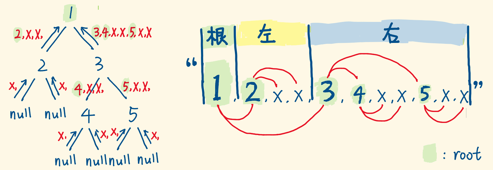
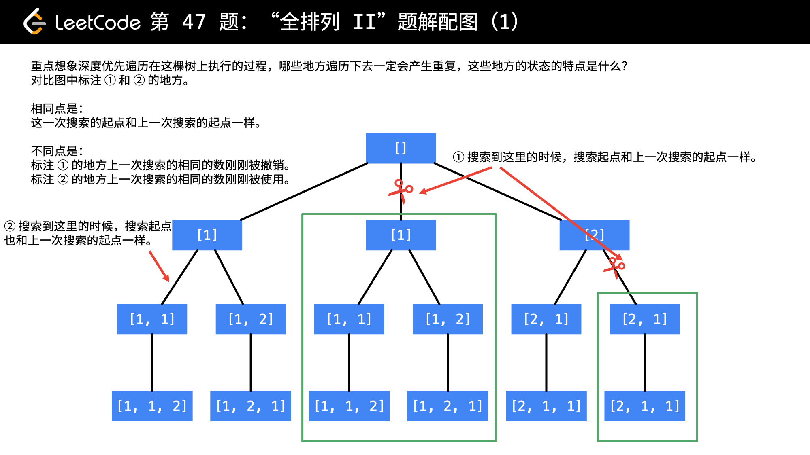

# 167. 两数之和 II - 输入有序数组 [每天一题] [双指针][ 简单]
1. https://leetcode-cn.com/problems/two-sum-ii-input-array-is-sorted/
2. 题目: 
  + 一个已按照升序排列 的有序数组，两个数相加之和等于目标数。
  + 函数应该返回这两个下标值 index1 和 index2，其中 index1 必须小于 index2。
  + 说明: 返回的下标值（index1 和 index2）不是从零开始的。

3. 思路: 双指针,分别指向头和尾, 利用有序的特性;

 
 
 

4. 代码:
+ map, index+1
+ 双指针
  ```Js
  var twoSum = function(numbers, target) {
      let left = 0, right =numbers.length -1;
      //从小到大的有序数组
      while(left  < right) {
        let sum = numbers[left] + numbers[right];
        if(sum > target) {
          right--;
        }else if(sum < target) {
          left++
        }else if(sum === target){
          return [left+1, right+1]
        }
      }
      return [-1, -1]
    
    }
  ```

5. 刷题记录:

|  时间   | 次数  | 备注  | 
| :---- | :----: | :---- |
| 07.20  |   1  | hashmap
| 07.20  |   1  | 双指针
| 07.25  |   1  | 双指针 (不是二分查找, 和mid没有关系), 如果和大了, 就小点, 如果和小了, 就大点


# 70. 爬楼梯 [见week1] [递归] [5]
1. https://leetcode-cn.com/problems/climbing-stairs/


2. 动态规划:
爬第n阶楼梯的方法数量，等于 2 部分之和:
+ 爬上 n-1 阶楼梯的方法数量。因为再爬1阶就能到第n阶
+ 爬上 n-2 阶楼梯的方法数量，因为再爬2阶就能到第n阶
所以我们得到公式 dp[n] = dp[n-1] + dp[n-2]
同时需要初始化 dp[0]=1 和 dp[1]=1
时间复杂度：O(n)

2. 代码:
```js
var climbStairs = function(n) {
  const dp = [];
  dp[0] = 1;
  dp[1] = 1;
  for(let i = 2; i <= n; i++) {
      dp[i] = dp[i - 1] + dp[i - 2];
  }
  return dp[n];
};

```
```js
 var climbStairs = function (n) {
   if(n <= 2) {
     return n;
   }
   let f1=1, f2=2, f3=3;
   for(let i = 3; i < n+1 ; i++) {
     f3 = f1 + f2;
     f1 = f2;
     f2 = f3;
   }
   return f3;
 }
```


# 22. 括号生成 [回溯]
1. https://leetcode-cn.com/problems/generate-parentheses/
2. 题目: 可能的并且 有效的 括号组合 ;

```js
输入：n = 3
输出：[
       "((()))",
       "(()())",
       "(())()",
       "()(())",
       "()()()"
     ]
```
3. 思路: 
+ 递归:
  + 先生成所有可能性的括号组合(包括不合法的)
    - 结束递归条件: < max(max=2*n)
    - 当前层的逻辑: 当前位置上添加"("或者")"
    - 进行下一层次的递归
  + 添加递归条件, 生成合法的括号组合:
    - left 添加的条件: 只要别超出n , count(left) < n;
    - right 添加的条件: 一定有left先添加, 就是 count(left) > count(right) 

4. 核心代码:
```js
 截止条件: left==n && right==n
 递归限制条件: 
    (left < n ) : 
    (right < left )
```

```js
//很像 中序遍历(参考题解代码)
  let generateParenthesis = (n) => {
    let res = [];
    let dfs = (s, left, right) => {
      if(left == n && right == n) return res.push(s);
      if(left < n) dfs(s+'(', left+1, right);
      if(right < left) dfs(s+')', left, right+1);
    }
    dfs('', 0, 0);
    return res;
  }
```

5. 刷题记录:

|  时间   | 次数  | 备注  | 
| :---- | :----: | :---- |
| 07.20  |   1  | 递归
| 07.20  |   1  | 回溯
| 07.25  |   1  | 回溯
| 07.26  |   1  | 回溯

# 226. 翻转二叉树 [简单] [交换, 递归]
1. https://leetcode-cn.com/problems/invert-binary-tree/description/
2. 示例: 
```
    4
   /   \
  2     7
 / \   / \
1   3 6   9

    4
   /   \
  7     2
 / \   / \
9   6 3   1
```
3. 思路:
+ 终止递归条件: 当前节点为null时返回
+ 交换当前节点的左右节点, 再递归交换当前节点的children
+ 交换流程, 很像 前序遍历, 访问root, 然后left, right

4. 代码片段:[递归, 前序遍历]
```js
if(root == null) return;
//交换当前节点
let tmp = root.right;
root.right = root.left;
root.left = tmp;
//递归交换当前节点的左子树
invertTree(root.left);
invertTree(root.right);
```

```js
//交换节点, 递归子节点,合成一句代码, 感谢es6
[root.left,root.right] = [invertTree(root.right),invertTree(root.left)];
```

5. 刷题记录:

|  时间   | 次数  | 备注  | 
| :---- | :----: | :---- |
| 07.20  |   1  | 
| 07.20  |   1  | 
| 07.25  |   1  | 

# 98. 验证二叉搜索树
1. https://leetcode-cn.com/problems/validate-binary-search-tree/
2. 题目: 
  假设一个二叉搜索树具有如下特征：
  + 节点的左子树只包含小于当前节点的数。
  + 节点的右子树只包含大于当前节点的数。
  + 所有左子树和右子树自身必须也是二叉搜索树。

3. 思路: 
+ 递归:


```js
  const helper = (root, lower, upper) {
    if(root === null) return true;
    if(root.val <= lower || root.val >= upper) return false;
    //lower < root.val < upper
    return helper(root.left, lower, root.val) && helper(root.right, root.val, upper);
  }
  var isValidBST = function(root) {
    return helper(root, -Infinity, Infinity)
  }
```

+ 中序遍历:  
  - 使用栈模拟中序遍历(出栈的顺序: left -> mid -> right)
  - 在中序遍历(升序)中,实时检查当前节点的值是否大于前一个中序遍历到的节点的值. 
  - 如果均大于: 说明序列是升序, 整棵树是二叉树
```js

```

4. 刷题记录:

|  时间   | 次数  | 备注  | 
| :---- | :----: | :---- |
| 07.20  |   1  | 递归 O(n)
| 07.20  |   1  | 中序遍历(栈) O(n)
| 07.25  |   1  | 递归 

# 104. 二叉树的最大深度
1. https://leetcode-cn.com/problems/maximum-depth-of-binary-tree/
2. 思路:
maxDepth(root) = max(maxDepth(root.left), maxDepth(root.right)) + 1;

3. 代码: [递归]
```js
 var maxDepth = function(root) {
  if(!root) return 0; 
  return Math.max(maxDepth(root.left), maxDepth(root.right)) + 1
};
```

4. 刷题记录:

|  时间   | 次数  | 备注  | 
| :---- | :----: | :---- |
| 07.21  |   1  | 
| 07.25  |   1  | 

# 111. 二叉树的最小深度
1. https://leetcode-cn.com/problems/minimum-depth-of-binary-tree/
2. 思路:关键是搞清楚递归结束条件:
  + 叶子节点的定义是左孩子和右孩子都为 null 时叫做叶子节点
  + 当 root 节点左右孩子都为空时，返回 1
  + 当 root 节点左右孩子有一个为空时，返回不为空的孩子节点的深度
  + 当 root 节点左右孩子都不为空时，返回左右孩子较小深度的节点值

3. 代码:
```js
var minDepth = function(root) [
  if(root == null) return 0;
  let m1 = minDepth(root.left);
  let m2 = minDepth(root.right);
  return root.left == null || root.right == null ? m1+m2+1 : Math.min(m1,m2)+1;
]
```

4. 刷题记录:

|  时间   | 次数  | 备注  | 
| :---- | :----: | :---- |
| 07.20  |   1  | 递归
| 07.25  |   1  | 递归


# 297. 二叉树的序列化与反序列化 
1. https://leetcode-cn.com/problems/serialize-and-deserialize-binary-tree/

2. 思路和代码: 
+ 序列化(递归):
  - 用递归遍历一棵树，只关注当前单个节点就好。剩下的工作交给递归完成
    “serialize 函数，麻烦帮我序列化我的左右子树，我等你的返回结果，再追加到我身上。”
  - 前序遍历，因为 <u>根|左|右</u> 的顺序在反序列化时，更容易定位出根节点值
  - 遇到 null 节点也要翻译成一个特殊符号，反序列化时才知道这里对应 null 节点
  ```js
  const serialize = (root) => {
    if(root==null) return 'X,'
    const leftSerialized = serialize(root.left); 
    const rightSerialized = serialize(root.right);
    return root.val + ',' + leftSerialized + rightSerialized;
  }
  ```

+ 反序列化——也是递归
  + 序列化时是前序遍历，所以序列化字符串呈现这样的排列:
  根 | (根|(根|左|右)|(根|左|右)) | (根|(根|左|右)|(根|左|右))

  + 

  + 流程: 
    - 写一个辅助函数，构建树的函数 buildTree，接收的是由序列化字符串转成 list 数组
    - 按照前序遍历的顺序构建：先构建根节点，再构建左子树、右子树
    - 将 list 数组的首项弹出，它是当前子树的 root 节点
    - 如果它为 'X' ，返回 null
    - 如果它不为 'X'，则为它创建节点，并递归调用 buildTree 构建左右子树
    - 当前子树构建完毕，向上返回

+ 代码:
```js
const buildTree = (list) => {        // dfs函数
  const nodeVal = list.shift()       // 当前考察的节点
  if (nodeVal == 'X') return null    // 是X，返回null给父调用
  const node = new TreeNode(nodeVal) // 创建node节点
  node.left = buildTree(list)        // 构建node的左子树
  node.right = buildTree(list)       // 构建node的右子树
  return node                        // 返回以node为根节点的子树给父调用
}

const deserialize = (data) => {
  const list = data.split(',')       // 转成list数组
  return buildTree(list)             // 构建树，dfs的入口
}

```

4. 刷题记录:

|  时间   | 次数  | 备注  | 
| :---- | :----: | :---- |
| 07.20  |   1  | 递归

# 95. 不同的二叉搜索树2 [每日一题] [递归]
1. https://leetcode-cn.com/problems/unique-binary-search-trees-ii/
2. 题目: 
给定一个整数 n，生成所有由 1 ... n 为节点所组成的 二叉搜索树;

3. 示例:
```
输入：3
输出：
[
  [1,null,3,2],
  [3,2,null,1],
  [3,1,null,null,2],
  [2,1,3],
  [1,null,2,null,3]
]
解释：
以上的输出对应以下 5 种不同结构的二叉搜索树：

   1         3     3      2      1
    \       /     /      / \      \
     3     2     1      1   3      2
    /     /       \                 \
   2     1         2                 3
```
4. 思路:
二叉搜索树: root(val) > left(val); root(val) < right(val)
假设当前序列长度为n, 枚举根节点的值为i, 根据二叉搜索树的性质
+ 左子树的节点值的集合为 [1...i-1]
+ 右子树的节点值的集合为 [i+1...n]
+ 左子树和右子树的生成相较于原问题 是一个序列长度缩小的子问题. 

5. 代码:
```js
//节点 start< end; Left:[start...i], right:[i+1...n]
// 结束递归条件: 
if (start > end) return [null];
// 递归:
  for (let i = start; i <= end; i++) {
    let leftNodes = buildTree(start, i - 1); 
    let rightNodes = buildTree(i + 1, end);
    
    for (const leftNode of leftNodes) {
      for (const rightNode of rightNodes) {
        let cur = new TreeNode(i);
        cur.left = leftNode;
        cur.right = rightNode;
        ans.push(cur);
      }
    }
  }
  return ans;
```
6. 刷题记录:

|  时间   | 次数  | 备注  | 
| :---- | :----: | :---- |
| 07.21  |   1  | 递归


# 236. 二叉树的最近公共祖先 [递归] [后根遍历] [条件]
1. https://leetcode-cn.com/problems/lowest-common-ancestor-of-a-binary-tree/
2. 题目: 略, 帮2个节点找他们的老爸(最近的)

3. 递归: (原谅我, 知道用递归, 却仍然不知道怎么思考), 参考题解:
+ 思路:
  + 如果当前结点 root 等于 NULL，则直接返回 NULL
  + 如果 root 等于 p或者 q ，那这棵树一定返回 p 或者 q
  + 递归左右子树，[因为是递归，使用函数后可认为左右子树已经算出结果]，用 left 和 right表示
  + 此时若left为空，那结果只看 right；若 right 为空，那结果只看 left(在root->left里面找一次，root->right里面再找一次，如果某一边返回值是NULL， 那么说明两个值都在另一边)
  + 如果 left 和 right 都非空，因为只给了 p 和 q 两个结点，都非空，说明一边一个，因此 root 是他们的最近公共祖先
  + 如果 left和 right 都为空，则返回空（其实已经包含在前面的情况中了）
  
+ 代码:
```js
var lowestCommonAncestor = function(root, p, q) {
    if(root == null || root == p || root == q){
        return root;
    }
    let left = lowestCommonAncestor(root.left,p,q);
    let right = lowestCommonAncestor(root.right,p,q);
    if(left != null && right != null){
        return root;
    }
    return left != null ? left : right;
};

```

4. 刷题记录:

|  时间   | 次数  | 备注  | 
| :---- | :----: | :---- |
| 07.21  |   1  | 递归
| 07.25  |   1  | 递归(写起来容易, 不太容易想)

# 105. 从前序与中序遍历序列构造二叉树
1. https://leetcode-cn.com/problems/construct-binary-tree-from-preorder-and-inorder-traversal/

2. 题目: 构造二叉树(preOrder, inOrder), 树中没有重复的元素
3. 示例:
```
  // input
  前序遍历 preorder = [3,9,20,15,7]
  中序遍历 inorder = [9,3,15,20,7]

  //返回如下的二叉树
     3
   / \
  9  20
    /  \
   15   7
```

4. 递归:
+ 思路:
  + 递归的思想，要把一棵树拆成结构相同但规模更小，那就是构建树的一个节点。
  + 子问题就是：返回下一个节点 ITreeNode（根 ，左子树，右子树），直到叶子节点结束

+ 递归逻辑:
  - 找前序的根。找到根节点 —— 前序遍历的第一个元素
  - 找中序的根。根据前序遍历根节点的值，找到中序遍历中对应的元素 —— 题目告知节点的值不会重复，所以能根据前序遍历的根节点一一对应到中序遍历的根节点
  - 找前序、中序的左、右子树。根据中序遍历的根节点（左子树、根、右子树），确定前序遍历、中序遍历各自的左子树、右子树（各自起始位置、结束位置）
  - 重复以上步骤直到叶子节点结束

+ 递归参数:
  - 根据递归逻辑，可以得知，只要确定了前序遍历、中序遍历的根节点，前序、中序的左、右子树（各自起始位置、结束位置），就可以确定下一个节点。
  - 所以递归参数：preorder、preLeft、preRight、inorder、inLeft、inRight、map
  - 在中序遍历中找到根节点的位置: 一种是遍历中序数组; 优化方案是 引入 map 来记录 inorder 值与下标的映射，来优化速度. 使用map来找到 inorder中根的位置, 因为没有重复数据, 
  ```js
   map[inorder[i]] = i;
  ```
+ 图解:
  

+ 核心代码:
```js
function buildSubtree(preorder, preLeft, preRight, inorder, inLeft, inRight, map) {
    if(preLeft > preRight || inLeft > inRight) {
        return null;
    }
    var treeNode = {}
    // 前序遍历的根节点对应 —— 该值 map 到的中序遍历的下标
    var inRootIndex = map[preorder[preLeft]];
    // 前序遍历，左子树的最后一位索引值 x
    // [x - preLeft] = [inRootIndex - inLeft]
    var x = inRootIndex + preLeft - inLeft;
    treeNode.val = preorder[preLeft];
    treeNode.left = buildSubtree(preorder, preLeft + 1, x, inorder, inLeft, inRootIndex - 1, map );
    treeNode.right = buildSubtree(preorder, x + 1, preRight, inorder,  inRootIndex + 1, inRight, map);
    // console.log(treeNode)
    return treeNode;
}


```

4. 刷题记录:

|  时间   | 次数  | 备注  | 
| :---- | :----: | :---- |
| 07.21  |   1  | 递归
| 07.25  |   1  | 递归

*** 
      回溯 
*** 

# 50. Pow(x, n)
1. https://leetcode-cn.com/problems/powx-n/
2. 题目: 计算 x的n次幂函数, 不使用封装函数; -100 < x < 100, n是32位有符号整数
``` 
输入: 2.00000, 10
输出: 1024.00000
```
3. 代码:
```js
var myPow = function(x, n) {
  if(n === 0) return 1;  // n=0直接返回1
  if(n < 0){   				//n<0时 x的n次方等于1除以x的-n次方分
    return 1 / myPow(x, -n)
  }
  // n是奇数 myPow(x, n-1) * x , n是偶数 myPow(x*x, n/2)
  return n % 2 ? x * myPow(x, n-1) : myPow(x*x,n/2)

}
   
```

4. 刷题记录:

|  时间   | 次数  | 备注  | 
| :---- | :----: | :---- |
| 07.21  |   1  | 递归
| 07.24  |   2  | 递归


# 78. 子集 [回溯]
1. https://leetcode-cn.com/problems/subsets/
2. 题目: 给定一组不含重复元素的整数数组 nums，返回该数组所有可能的子集（幂集）。 说明：解集不能包含重复的子集。
3. 示例:
```
输入: nums = [1,2,3]
输出:
[
  [3],
  [1],
  [2],
  [1,2,3],
  [1,3],
  [2,3],
  [1,2],
  []
]
```

3. 回溯模板:
```js

/**
 * @param {number[]} nums
 * @return {number[][]}
 */
var subsets = function(nums) {
    var result = [];
    var subsets = [];
    var index = 0;
    var len = nums.length;

    function combinate(subsets,index){
         // terminator
        if(index == len){
            result.push(subsets)
            return;
        }
        // process
        combinate(subsets,index+1);
        subsets.push(nums[index]);
        combinate(subsets.slice(0),index+1);
        // reverse states
        subsets.pop();

        //或
        // process
        // combinate(subsets.slice(0),index+1);
        // subsets.push(nums[index]);
        // combinate(subsets.slice(0),index+1);
    }
    combinate(subsets,0);
    return result;
};

```

4. 迭代 (iteration):
+ 如果 nums：[1,2,3];
  - 初始化：res = []
  - i = 0 [1]         res = [[],[1]]
  - i = 1 [2],[1,2],  res = [ [],[1],[2],[1,2]]
  - i = 2 [3],[1,3],[2,3],[1,2,3]
    res = [ [],[1],[2],[1,2],[3],[1,3],[2,3],[1,2,3] ]
+ 总结: 
重复将新的元素加入到上一个结果集中的每个子集当中去，形成n个新的子集，再全部加入到结果集中去

4. 刷题记录:

|  时间   | 次数  | 备注  | 
| :---- | :----: | :---- |
| 07.21  |   1  | backtrack
| 07.24  |   1  | backtrack , iteration


# 77. 组合
1. https://leetcode-cn.com/problems/combinations/
2. 给定两个整数 n 和 k，返回 1 ... n 中所有可能的 k 个数的组合。
```
输入: n = 4, k = 2
输出:
[
  [2,4],
  [3,4],
  [2,3],
  [1,2],
  [1,3],
  [1,4],
]
```

3. 思路: 与上面的题目相似

4. 刷题记录:

|  时间   | 次数  | 备注  | 
| :---- | :----: | :---- |
| 07.21  |   1  | backtrack
| 07.24  |   2  | backtrack


# 46. 全排列
1. https://leetcode-cn.com/problems/permutations/
2. 题目:
+ 给定一个 没有重复 数字的序列，返回其所有可能的全排列。
```
输入: [1,2,3]
输出:
[
  [1,2,3],
  [1,3,2],
  [2,1,3],
  [2,3,1],
  [3,1,2],
  [3,2,1]
]
```

3. backtrack: 套模板
+  写一个 backtrack()函数: push, backtrack, pop
+  图解:
  

4. 思路:
- 递归的入口： path空数组，代表未选择的状态，它有3个选择，对应3个分支
- 每个子节点又有3个选择，选择不同的数字就组成了不同的路径
- 递归的出口：path长度等于nums长度，代表已经选满了，生成了一个排列，推入结果数组
- 遍历nums数组，如果path中已经存在当前数字，则不推入path，继续考察下一个数字
- 否则，推入path，并且递归调用dfs，继续选下一个数字，直到选满
- path.pop() 做的是回溯，path的最后一个选择被撤销，回到之前的状态，继续下一次递归 (回到 path=[2]的状态, 继续递归, 将新的数字推入path;再回溯到 path=[3], 递归 )
- 回溯会穷举整个树


5. 代码:
```js
  const permute = (nums) => {
    let res = []; //结果, 后面return
    //辅助函数
    backtrack(res, [], nums);
    return res; 
  }

  function backtrack(res, path, nums) {
    //结束递归:
    if(path.length == nums.length) {
      return res.push([...path])
    }

    //循环遍历: push(num), backtrack(....), pop()
    for(const num of nums) {
      if(path.includes(num)) continue;
      path.push(num);
      backtrack(path);
      path.pop()

    }
  }
```

6. 刷题记录:

|  时间   | 次数  | 备注  | 
| :---- | :----: | :---- |
| 07.22  |   1  | backtrack


# 47. 全排列 II [重复数字][排序, 在回溯中去重]
1. https://leetcode-cn.com/problems/permutations-ii/
2. 题目: 给定一个可包含重复数字的序列，返回所有不重复的全排列
```
输入: [1,1,2]
输出:
[
  [1,1,2],
  [1,2,1],
  [2,1,1]
]
```

3. 去重:
+ 图解:
; 

+ 参考 题解:

+ 去重 添加代码
```js
// hash[i-1] 表示 
if(hash[i] || (i > 0 && !hash[i-1] && nums[i-1] == nums[i])) continue;
```


5. 刷题记录:

|  时间   | 次数  | 备注  | 
| :---- | :----: | :---- |
| 07.24  |   1  | sort + backtrack + 去重


# 153. 寻找旋转排序数组中的最小值 [与offer11相似] [二分查找] [ 没有重复值]
1. https://leetcode-cn.com/problems/find-minimum-in-rotated-sorted-array/
2. 题目:
+ 假设按照升序排序的数组在预先未知的某个点上进行了旋转。
( 例如，数组 [0,1,2,4,5,6,7] 可能变为 [4,5,6,7,0,1,2] )。请找出其中最小的元素。你可以假设数组中不存在重复元素。
3. 示例:
```
输入: [3,4,5,1,2]
输出: 1

输入: [4,5,6,7,0,1,2]
输出: 0

```

4. 二分搜索 
+ 对于 js, 最重要是如何得到mid?
  - var mid = (left + right) >> 1; 

+ 官方解: 
  + 需要找到[变化点], 其特点是：
    - 所有变化点左侧元素 > 数组第一个元素
    - 所有变化点右侧元素 < 数组第一个元素
  + 算法
    - 找到数组的中间元素 mid。  
    - nums[mid] > nums[0]，在 mid 右边 search 变化点
    - nums[mid] < nums[0], 在 mid 左 search 变化点
    - 找到变化点时停止搜索，当以下条件满足任意一个即可：
      - nums[mid] > nums[mid+1] , 最小值 nums[mid+1]
      - nums[mid-1] > nums[mid], 最小值 nums[mid]

+ 点赞高: [ 只比较 mid与right, 获取nums[left]]
  - 求出 mid
  - while (left < right), return nums[left]
  - nums[mid] > nums[right], 目标元素在mid右侧, left= mid+1;
  - nums[mid] < nums[right], 目标元素在mid左侧, right= mid;- 旋转数组前升序排列, 
  - 找最小值, 偏向left找, 比较 mid 和 right, 改变right
  - 找最大值, 偏向right找, 比较 mid 和 left, 该笔left

+ 二刷题目后看到的容易理解的题解(图):
参考 https://leetcode-cn.com/problems/find-minimum-in-rotated-sorted-array/solution/yi-wen-jie-jue-4-dao-sou-suo-xuan-zhuan-pai-xu-s-3/
  
+ 如果数组没有翻转，即 nums[left] <= nums[right]，则 nums[left] 就是最小值，直接返回。
+ 如果数组翻转, 需要找到数组中第二部分的第一个元素:
  - 
+ 讨论数组翻转的情况, 如何收缩区间找到这个元素:
   - 
   - 如果 nums[left] <= nums[mid], 说明区间 [left, mid] 连续递增，则最小元素一定不在这个区间里，可以直接排除。因此，令 left = mid+1，在 [mid+1,right] 继续查找
   - 否则，说明区间 [left,mid] 不连续，则最小元素一定在这个区间里。因此，令 right = mid，在 [left,mid] 继续查找
   - [left,right] 表示当前搜索的区间。注意 right 更新时会被设为 mid 而不是 mid-1，因为 mid 无法被排除。

5. 刷题记录:

|  时间   | 次数  | 备注  | 
| :---- | :----: | :---- |
| 07.22  |   1  | 二分搜索
| 07.24  |   1  | 二分搜索, 没有for, 不要遍历nums
| 07.24  |   1  | 二分搜索, nums[mid] 和 nums[right] 比较, 返回 nums[left]


# 剑指 Offer 11. 旋转数组的最小数字 [每日一题] [ 输入数组的值有重复]
1. https://leetcode-cn.com/problems/xuan-zhuan-shu-zu-de-zui-xiao-shu-zi-lcof/solution/xuan-zhuan-shu-zu-de-zui-xiao-shu-zi-by-leetcode-s/
2. 题目:
把一个数组最开始的若干个元素搬到数组的末尾，我们称之为数组的旋转。输入一个递增排序的数组的一个旋转，输出旋转数组的最小元素。例如，数组 [3,4,5,1,2] 为 [1,2,3,4,5] 的一个旋转，该数组的最小值为1。
3. 示例:
```js
输入：[3,4,5,1,2]
输出：1

输入：[2,2,2,0,1]
输出：0
```

4. 思路:
+ 最简单暴力: 排序
  ```js
  var minArray = function(numbers) {
    numbers.sort((a, b) => a-b);
    return numbers[0]
  }
  ```
+ 二分查找 : 考虑nums[mid] = nums[right]

5. 代码:
```js
var minArray = function(numbers) {
  let left = 0;
  let right = numbers.length - 1;

  while (left < right) {
    const mid = left + right >>> 1;
    if (numbers[mid] > numbers[right]) {
      left = mid + 1;
    } else if (numbers[mid] == numbers[right]) {
      right--;
    } else {
      right = mid;
    }
  }
  return numbers[left];

};
```

6. 刷题记录:

|  时间   | 次数  | 备注  | 
| :---- | :----: | :---- |
| 07.22  |   1  | 二分搜索
| 07.24  |   1  | 二分搜索

# 64. 最小路径和 [每日一题] [动态规划] [很经典,我终于明白了!]
1. https://leetcode-cn.com/problems/minimum-path-sum/
2. 题目: 给定一个包含非负整数的 m * n 网格，请找出一条从左上角到右下角的路径，使得路径上的数字总和为最小。每次只能向下或者向右移动一步。
3. 示例:
```
输入:
[
  [1,3,1],
  [1,5,1],
  [4,2,1]
]
输出: 7
解释: 因为路径 1→3→1→1→1 的总和最小。
```

4. 动态规划(很经典) : 
+ 状态定义：
设 dp 为大小 m*n 矩阵，其中 dp[i][j] 的值代表直到走到 (i,j)(i,j) 的最小路径和。

+ 转移方程：
> 题目要求，只能向右或向下走，换句话说，当前单元格 (i,j)(i,j) 只能从左方单元格 (i-1,j)(i−1,j) 或上方单元格 (i,j-1)(i,j−1) 走到，因此只需要考虑矩阵左边界和上边界。
 + grid[i][j] = min(grid[i - 1][j], grid[i][j-1]) + grid[i][j]
   具体分4种情况:
    1. 当左边和上边都不是矩阵边界时: 即 i!=0 && j!=0 时, 
      dp[i][j] = min(dp[i-1][j], dp[i][j-1]) + grid[i][j];
    2. 当只有左边是矩阵边界时: 只能从上面来, 即 i==0 && j!=0 时, 
      dp[i][j] = dp[i][j-1] + grid[i][j];
    3. 当只有上边是矩阵边界时: 只能从左来,  即 i!=0 && j==0 时, 
      dp[i][j] = dp[i-1][j] + grid[i][j];
    4. 当左边和上边都是矩阵边界时:  即 i==0 && j==0 时,(起点),
      dp[i][j] = grid[i][j];

+ 初始状态：
  - dp 初始化即可，不需要修改初始 0 值。

+ 返回值：
  - 返回 dp 矩阵右下角值，即走到终点的最小路径和。

+ 备注:其实我们完全不需要建立 dp 矩阵浪费额外空间，直接遍历 grid[i][j]修改即可。这是因为：grid[i][j] = min(grid[i - 1][j], grid[i][j - 1]) + grid[i][j] ；原 grid 矩阵元素中被覆盖为 dp 元素后（都处于当前遍历点的左上方），不会再被使用到。

+ 时间复杂度:  O(M*N) ： 遍历整个 grid 矩阵元素
+ 空间复杂度: O(1),直接修改原矩阵, 不使用额外空间var

5. 代码:
```js
var minPathSum = function(grid) {
  // let grid[i][j] = min(grid[i-1][j], grid[i][j-1]) + grid[i][j];
  for(let i = 0; i < grid.length; i++) {
    for(let j = 0; j < grid[0].length; j++)  {
      if(i == 0 && j == 0) {
        // grid[i][j] = 0;
        continue;
      }else if(i == 0) {
        grid[i][j] = grid[i][j-1] + grid[i][j];
      }else if(j == 0) {
        grid[i][j] = grid[i-1][j] + grid[i][j];
      }else{
        grid[i][j] = Math.min(grid[i-1][j], grid[i][j-1]) + grid[i][j];
      }
    }
  }

  return grid[grid.length-1][grid[0].length-1]
};
```

6. 刷题记录:

|  时间   | 次数  | 备注  | 
| :---- | :----: | :---- |
| 07.23  |   2  | 动态规划

# 17.电话号码的字母组合
1. https://leetcode-cn.com/problems/letter-combinations-of-a-phone-number/
2. 题目: 略
3. 思路:

代码: 
```js
/**
 * @param {string} digits
 * @return {string[]}
 */
var letterCombinations = function(digits) {
  //将digits 转入map
  let map = new Map();
  map.set('2', 'abc'); //...
  //...
  
  let res = [];
  function _helper(i, str){
    //结束递归条件, str
    if(i == digits.length){
      //或 str.length = digits.length
      res.push(str);
      return;
    }

    let tmp = map.get(digits[i]);
    //遍历 tmp (比如 abc)
    for(let s = 0 ; s < tmp.length; s++) {
      _helper(i+1, str + tmp[s]);
    }

  }

  _helper(0, '');
  return res;
};
```
6. 刷题记录:

|  时间   | 次数  | 备注  | 
| :---- | :----: | :---- |
| 07.23  |   2  | 回溯

# 169. 多数元素 [简单] [新颖: 投票算法]
1. https://leetcode-cn.com/problems/majority-element/description/
2. 题目: 
给定一个大小为 n 的数组，找到其中的多数元素。多数元素是指在数组中出现次数大于 [n/2]的元素。你可以假设数组是非空的，并且给定的数组总是存在多数元素。

3. 示例: 
```
输入: [3,2,3]
输出: 3

输入: [2,2,1,1,1,2,2]
输出: 2
```

4. 代码:
+ 排序:
  因为大于一半, 所以排序后的 中间那个数必是
  ```js
    var majorityElement = function(nums) {
      nums.sort((a,b) => a-b);
      return nums[Math.floor(nums.length / 2)]
    }
  ```
+ hashmap :
+ obj
  ```js
  var majorityElement = function(nums) {
     let half = Math.floor(nums.length / 2);
     let obj =  {};
     for(let num of nums) {
      obj[num] = (obj[num] || 0) + 1;
      if(obj[num] > half) return obj[num]
     }
  }
  ```
+ Boyer-Morre 摩尔投票算法 (精妙): 

  - 相同的加1, 不相同的减1, 因为是大于一半, 最后肯定剩下大于一半的那个 ;
```js
  var majorityElement = function(nums) {
    let candidate = 0; 
    let cnt = 0
    for(let i = 0;i < nums.length;i++){
        if(cnt === 0){
          candidate = nums[i];
        }
        cnt += (nums[i] == candidate)? 1 : -1
    }
    return candidate;

};
```

6. 知识补充:
+ 参考 : https://www.jianshu.com/p/696363f3774c
+ 摩尔投票算法 以1981年出版的Robert S. Boyer和J Strother Moore的名字命名
+ 最简单的形式就是，查找输入中重复出现超过一半以上(n/2)的元素。如果序列中没有这种元素，算法不能检测到正确结果，将输出其中的一个元素之一。如果不能保证输入数据中有占有一半以上的元素，需要再遍历一下验证。
+ 这里有两个先觉条件要明确：
  - 出现超过一半以上(n/2)的元素有且只有一个；
  - 这个元素一定存在


7. 刷题记录:

|  时间   | 次数  | 备注  | 时间复杂度
| :----: | :----: | :----:  |:----:|
| 07.23  |   2  | 排序| O(nlogn)|
| 07.23  |   2  | hashmap |O(n)|
| 07.23  |   2  | Obj对象 |O(n)|
| 07.23  |   2  | boyerMoor +1(-1)抵消|O(n)|


# 51. N皇后 [很难, 挣扎...]
1. https://leetcode-cn.com/problems/n-queens/
2. 题目: 

3. 示例: 
```
输入: [3,2,3]
输出: 3

输入: [2,2,1,1,1,2,2]
输出: 2
```

4. 思路: 参考视频和题解;

5. 代码:


6. 刷题记录:

|  时间   | 次数  | 备注  | 
| :---- | :----: | :---- |
| 07.23  |   1  | 回溯


# 1025. 除数博弈 [每日一题][玩一次就理解了]
1. https://leetcode-cn.com/problems/divisor-game/
2. 题目:
爱丽丝和鲍勃一起玩游戏，他们轮流行动。爱丽丝先手开局。最初，黑板上有一个数字 N 。在每个玩家的回合，玩家需要执行以下操作：
  + 选出任一 x，满足 0 < x < N 且 N % x == 0 。
  + 用 N - x 替换黑板上的数字 N 。
如果玩家无法执行这些操作，就会输掉游戏。
只有在爱丽丝在游戏中取得胜利时才返回 True，否则返回 false。假设两个玩家都以最佳状态参与游戏。
1 <= N <= 1000;


3. 示例:
```
输入：2
输出：true
解释：爱丽丝选择 1，鲍勃无法进行操作。
```

4. 理解:
读完, 有点蒙. 后来仔细分析下, 试着写几项试试, Alice先开始:
Alice在(0, N)中取的数字, 首先一定满足 N%x==0, N一定被x整除. 任何一个数%1==0, Alice会优先选择x=1
+ N=1, (0,1)中没有整数, Alice: false
+ N=2, (0,2), Alice get 1(x) because [N%x]==0 && [N-x=2-1=1], N=1, Alice:true
+ N=3, (0,3), 
  - Alice get 1(x) , [N%x=3%1==0], [N-x=3-1=2], N 变成2. Bob继续N=2, 根据之前N=2的结论, Bob获胜, Alice:false
  - Alice can not get 2(x), because N%x=3%2!=0
+ N=4, (0, 4),
  - Alice get 1(x), [N%x=4%1==0], [N-x=4-1=3], N 变成3. Bob继续N=3, 根据之前N=3的结论, Bob失败,Alice:true;
  - Alice get 2(x), [N%x=4%2==0], [N-x=4-2=2], N 变成2. Bob继续N=2, 根据之前N=2的结论, Bob获胜,
  Alice:false (??????)
+ N=5, (0, 5), Alice只能拿1, 根据N=4的结论, Alice: false;

> N 为奇数的时候 Alice（先手）必败，NN 为偶数的时候 Alice 必胜。
+ 证明见题解


# 410. 分割数组的最大值 [每日一题] [题解没有理解] [TODO]
1. https://leetcode-cn.com/problems/split-array-largest-sum/submissions/
2. 题目: 
给定一个非负整数数组和一个整数 m，你需要将这个数组分成 m 个非空的连续子数组。设计一个算法使得这 m 个子数组各自和的最大值最小;
数组长度 n 满足以下条件:
+ 1 ≤ n ≤ 1000
+ 1 ≤ m ≤ min(50, n);

3. 示例: 
```
输入:nums = [7,2,5,10,8],  m = 2;
输出: 18;
解释:
一共有四种方法将nums分割为2个子数组。
其中最好的方式是将其分为[7,2,5] 和 [10,8]，
因为此时这两个子数组各自的和的最大值为18，在所有情况中最小。
```

4. 题解:
+ 子数组的最大值范围，即在区间 [max(nums),sum(nums)] 之中。
+ 令 l = max(nums)，h = sum(nums), mid=(l+h)/2 , (这里???, low, height 为啥不是index的值)
+ 计算数组和最大值不大于mid对应的子数组个数 cnt(这个是关键！???没有理解) 
  - 如果 cnt>m，说明划分的子数组多了，即我们找到的 mid 偏小，故 l=mid+1；
  - 否则，说明划分的子数组少了，即 mid 偏大(或者正好就是目标值)，故 h=mid。


