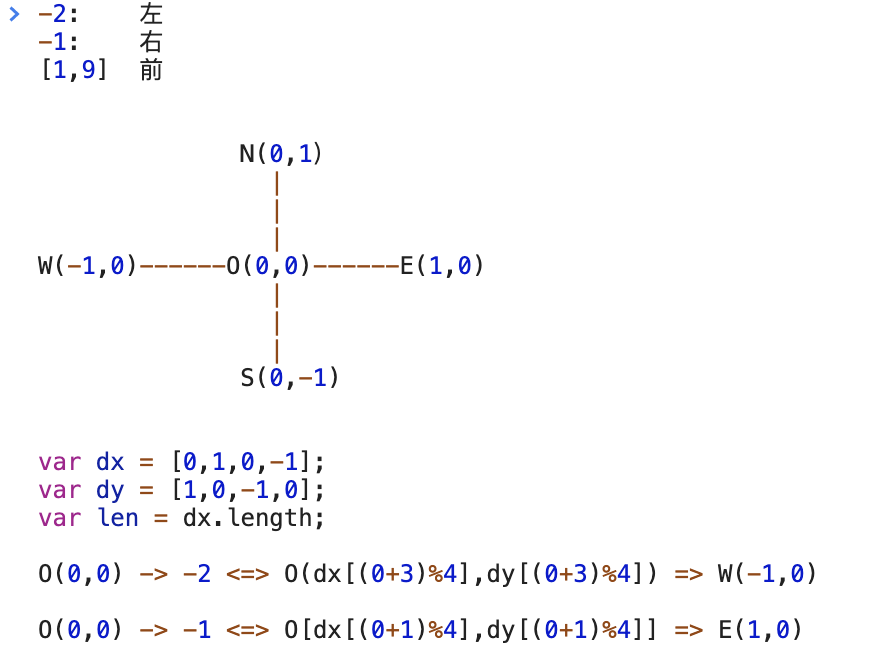

# 392. 判断子序列 [每日一题] [简单] [有趣]
1. https://leetcode-cn.com/problems/is-subsequence/
2. 题目:
+ 给定字符串 s 和 t ，判断 s 是否为 t 的子序列。 s 和 t 中仅包含英文小写字母。
+ 字符串 t 可能会很长（长度 ~= 500,000），而 s 是个短字符串（长度 <= 100）。
+ 字符串的一个子序列是原始字符串删除一些（也可以不删除）字符而不改变剩余字符相对位置形成的新字符串。（例如，"ace"是"abcde"的一个子序列，而"aec"不是）。

3. 示例:
```
示例 1:
s = "abc", t = "ahbgdc"; 返回 true.

示例 2:
s = "axc", t = "ahbgdc"; 返回 false.

```
后续挑战(!!!):如果有大量输入的 S，称作S1, S2, ... , Sk 其中 k >= 10亿，你需要依次检查它们是否为 T 的子序列。在这种情况下，你会怎样改变代码？

4. 思路:
+ 贪心算法:
  + 要使字符串s的排序要和字符串t的排序一致，我们只需考虑两个要素
    - 当字符'a'出现，判断字符传t中是否存在字符'a'
    - t中字符‘a'之后的剩余字符串是否存在’b'
  + 用一句通俗的话就是[剩余字符串中是否存在下一个字符]；利用贪心算法的概念就是局部是否存在最优解。

5. 贪心算法: 不必考虑前面的影响, 只需考虑当前的状态
个人体会: 贪心的认为, 后面还是有的

6. 刷题记录:

|  时间   | 次数  | 备注  | 
| :---- | :----: | :---- |
| 07.27  |   1  | 贪心算法(相信剩余中还有)


# 102. 二叉树的层序遍历 [BFS]
1. https://leetcode-cn.com/problems/binary-tree-level-order-traversal/#/description
2. 题目: 给你一个二叉树，请你返回其按 层序遍历 得到的节点值。 （即逐层地，从左到右访问所有节点）。
  
3. 示例:
```
//二叉树：[3,9,20,null,null,15,7],
    3
   / \
  9  20
    /  \
   15   7

返回其层次遍历结果：
[
  [3],
  [9,20],
  [15,7]
]
```

4. 代码:
+ map, index+1
+ 双指针


5. 刷题记录:

|  时间   | 次数  | 备注  | 
| :---- | :----: | :---- |
| 07.27  |   1  | BFS


# 22. 括号生成 [参考 week3]
1. https://leetcode-cn.com/problems/generate-parentheses/#/description

# 515. 在每个树行中找最大值 [与102一样]
1. https://leetcode-cn.com/problems/find-largest-value-in-each-tree-row/#/description

2. 题目:您需要在二叉树的每一行中找到最大的值。
```
输入: 

          1
         / \
        3   2
       / \   \  
      5   3   9 

输出: [1, 3, 9]

```

3. 代码:

```js
var largestValues = function(root) {
  if (!root) return [];
  let queue = [root]; 
//[
//   TreeNode {
//     val: 1,
//     left: TreeNode { val: 3, left: [TreeNode], right: [TreeNode] },
//     right: TreeNode { val: 2, left: null, right: [TreeNode] }
//   }
// ]
  let ans = [];

  while(queue.length) {
    let len = queue.length; 
    let currentMax = -Infinity;
    while (len--) {
        let node = queue.shift();
        currentMax = Math.max(currentMax, node.val);
        if (node.left) queue.push(node.left);
        if (node.right) queue.push(node.right);
    }
    ans.push(currentMax);
  }
  return ans;

}

```


# 433. 最小基因变化 [BFS]
1. https://leetcode-cn.com/problems/minimum-genetic-mutation/#/description
2. 题目理解:
  + 从一个字符串变化到另外的一个字符串,每次变化都是8个字符(数量不会变化), 经过的最少步骤 => BFS
  + 每次改变只改变其中的一个字母, 并且改变的字母是在数组['A','C','G','T']中的
  + 改变后的字符串要在数据bank中找到
  + 起始字符串不一定在bank中, 但是结尾字符串(最终变化成的样子)在bank中
  ```
  start: "AAAAACCC"
  end:   "AACCCCCC"
  bank: ["AAAACCCC", "AAACCCCC", "AACCCCCC"]

  返回值: 3

  ```

3. 思路(BFS):
    +  遍历这个字符串中的每个字符,将该字母改变为['A','C','G','T']中的每一个;
      - 比如 输入 ACGT , 改变第一个字母会产生一组变体: [CCGT, GCGT, TCGT];
    +  在bank中查找是否存在 变身后的字符串
    +  如果在bank中找到了一个变体, 将level(次数)+1, 并将这个变体保存在一个queue中, 这个queue是用来作为找到下个变体的起始值.
    +  继续遍历这个字符串的下一个字母
    +  查看queue中是否还有值, 如果有值, 就对其重复上面的步骤, 找到下一个有效变体(就是bank中存在的)
    +  直到最后的变体是end, 在bank中找到, 完成任务; 在bank中始终没有找到匹配变体的字符串, 则返回-1;

4. 代码见html, 很长,思路要清晰, 双端BFS没有看懂

5. 刷题记录:

|  时间   | 次数  | 备注  | 
| :---- | :----: | :---- |
| 07.31  |   1  | BFS

# 127. 单词接龙 [没有理解] [todo]
1. https://leetcode-cn.com/problems/word-ladder/description/
2. 示例:
  ```
    输入:
    beginWord = "hit",
    endWord = "cog",
    wordList = ["hot","dot","dog","lot","log","cog"]

    输出: 5

    解释: 一个最短转换序列是 "hit" -> "hot" -> "dot" -> "dog" -> "cog",
        返回它的长度 5。

  ```
5. 刷题记录:

|  时间   | 次数  | 备注  | 
| :---- | :----: | :---- |


# 126. 单词接龙II [todo]
1. https://leetcode-cn.com/problems/word-ladder-ii/description/

# 200. 岛屿数量 [DFS] [巧妙]
1. https://leetcode-cn.com/problems/number-of-islands/
2. 题目:
3. 思路:
遍历每个点, 对其上下左右的点做[DFS],遇到了'1', 将其变成'0', 然后向上返回, 继续遍历
4. 刷题记录:

|  时间   | 次数  | 备注  | 
| :---- | :----: | :---- |
| 07.28  |   1  | DFS

# 529. 扫雷游戏  [题目还是没有理解]
1. https://leetcode-cn.com/problems/minesweeper/description/
2. 读题:
+ M 一个未挖出的地雷
+ E 一个未挖出的空方块
+ B 没有相邻地雷的已挖出的空白方块
规则:
  + click M, M -> X
  + click 一个(没有相邻M的)E, E -> B, 和这个E相邻的方块都应该被递归->B
  + click 一个至少与一个M相邻的E, E-> (1 到 8), 表示相邻M的数量 
  + 如果在此次点击中，若无更多方块可被揭露，则返回面板。

3. 示例和解释:
```
输入: 

[['E', 'E', 'E', 'E', 'E'],
 ['E', 'E', 'M', 'E', 'E'],
 ['E', 'E', 'E', 'E', 'E'],
 ['E', 'E', 'E', 'E', 'E']]

Click : [3,0]

输出: 

[['B', '1', 'E', '1', 'B'],
 ['B', '1', 'M', '1', 'B'],
 ['B', '1', '1', '1', 'B'],
 ['B', 'B', 'B', 'B', 'B']]

// 点击 [3, 0], 左下角的位置
于是这个点的相邻点, 从E->B, 其邻居的邻居E->B依次被挖出
与被挖出E点相邻的E点,发现自身与M相邻, 则与M相邻的E改为数字1
```

3. 理解(参考 题解):
+ 'M' ：埋了一个地雷，没有挖出
+ 'X' ：埋了一个地雷，且已经挖出来了, 说明踩到地雷了，game over
+ 'E' ：埋了一个东西，可能是地雷，也可能是空的
+ 'B' ：一个已经挖出的空的东西，且它的四面八方没有地雷. 
    + 上、下、左、右、左上、左下、右上、右下
    + 对于每个四面八方没有地雷相邻的点作此深度优先搜索
        + 如果是非 'E'
          - 要么是未挖出的地雷 'M'
          - 要么是已经挖出的空白且四面八方没有地雷的方块
          - 要么是已经挖出地雷 'X'
        + 均退出循环，没有必要继续当前搜索，直接进入下一个方向的搜索

4. 求解
+ 如果当前点击位置是 'M' ，将它标记为 'X' ，并返回游戏板
+ 如果不是，说明点击的是 'E'
    + 计算当前点四面八方是否有地雷
      - 有，算出数量，并将当前点标记为此数量，结束当前方向的搜索
      - 无，将它标记为 'B'，并继续下一个方向的搜索
+ 搜索: 八大方向中的其中一点如果是 'M' 或者 'X'，说明有地雷
+ 边界: 当前点的横、纵坐标不能小于0，不能大于一维、二维长度


*** 二分查找 ***


# 69. x的平方根
1. https://leetcode-cn.com/problems/sqrtx/
2. 题目: 
+ 实现 int sqrt(int x) 函数。计算并返回 x 的平方根，其中 x 是非负整数。
+ 由于返回类型是整数，结果只保留整数的部分，小数部分将被舍去。
3. 示例: 
```
输入: 8
输出: 2
说明: 8 的平方根是 2.82842..., 
     由于返回类型是整数，小数部分将被舍去。
```

4. 思路:

5. 刷题记录:

|  时间   | 次数  | 备注  | 
| :---- | :----: | :---- |
| 07.28  |   1  | 二分查找


# 367. 有效的完全平方数 [同69 x的平方根] [ 累加]
1. https://leetcode-cn.com/problems/valid-perfect-square/
2. 题目: 
给定一个正整数 num，编写一个函数，如果 num 是一个完全平方数，则返回 True，否则返回 False。
3. 示例:
```
输入：16
输出：True
```
4. 数学定理:
+ 等差数列: 任意一个平方数都可以表示出下面的奇数序列和 
+ 1+3+5+7+...+(2N-1) = N^2

```js
var isPerfectSquare = function(num) {
    if (num == 0 ) return false;

    let i = 1;
    while ( num > 0){
        num -= i;
        i += 2;
    }
    return num == 0 ? true : false;

}

```

5. 牛顿迭代法: 
问题是找出：f(x)=x^2−num=0 的根。
牛顿迭代法的思想是从一个初始近似值开始，然后作一系列改进的逼近根的过程。

x = 1/2 (x + num / x);

```js
var isPerfectSquare = function(num) {
   if(num == 1) return 1;

    var tmp = num;
    while(num * num > tmp) {
      num = (num + tmp/num) >> 1;
    }
    return num*num == tmp;

}
```


# 33. 搜索旋转排序数组 [二分] [参考搜索旋转排序]
1. https://leetcode-cn.com/problems/search-in-rotated-sorted-array/


# 153. 寻找旋转排序数组中的最小值 [二分] [参考week3]
1. https://leetcode-cn.com/problems/find-minimum-in-rotated-sorted-array/

2. 代码:
```js
 var findMin = function(nums) {
    var left = 0;
    var right = nums.length - 1;
    if(nums[left] <= nums[right]) return nums[left];

    while (left < right) {
        var mid = (left + right) >> 1; 
        if (nums[mid] > nums[right]) { 
          // [left,mid] 连续递增，则在 [mid+1,right] 查找
            left = mid + 1;
        } else if(nums[mid] < nums[right]){
         // [left,mid] 不连续，在 [left,mid] 查找
            right = mid;
        }
    }
    return nums[left]; //return nums[right] 也通过

  };
  
```


# 74. 搜索二维矩阵 [二维数组] [二分] 
1.https://leetcode-cn.com/problems/search-a-2d-matrix/

# 题目:
+ 使用二分查找，寻找一个半有序数组 [4, 5, 6, 7, 0, 1, 2] 中间无序的地方, 说明：同学们可以将自己的思路、代码写在学习总结中

+ 思路:
>  ;

5. 刷题记录:

|  时间   | 次数  | 备注  | 
| :---- | :----: | :---- |
| 07.28  |   1  | 二分查找

*** 贪心算法 ***

# 322. 零钱兑换 [] [] 
1. https://leetcode-cn.com/problems/coin-change/

2. 题目:
+ 给定不同面额的硬币 coins 和一个总金额 amount。编写一个函数来计算可以凑成总金额所需的最少的硬币个数。如果没有任何一种硬币组合能组成总金额，返回 -1。

3. 示例:
```
输入: coins = [1, 2, 5], amount = 11
输出: 3 
解释: 11 = 5 + 5 + 1;

输入: coins = [2], amount = 3
输出: -1
```

+ 思路:
>  ;

4. 动态规划:
```
 dp[amount] = min(1 + dp[amount - coin[i]]) 
 for i in [0, len - 1] 
 if coin[i] <= amount

```
5. 刷题记录:

|  时间   | 次数  | 备注  | 
| :---- | :----: | :---- |
| 07.29  |   1  | 动态规划
| 07.29  |   1  | 贪心


# 860. 柠檬水找零 [贪心] [模拟现实]
1. https://leetcode-cn.com/problems/lemonade-change/
2. 题目: 
  + 题意每张账单只能是5,10,20
  + 柠檬水均是5元一份
  + 店家自己没有零钱
3. 思路: 跟实际生活中找零思路是一样的，先用大面额的，再用小面额凑成找零。实在没有大面额的，就直接用小面额的凑成找零。 见代码

5. 刷题记录:

|  时间   | 次数  | 备注  | 
| :---- | :----: | :---- |
| 07.29  |   1  | 贪心


# 122. 买卖股票的最佳时机 II [贪心] [卖出 - 买入 > 0]
1. https://leetcode-cn.com/problems/best-time-to-buy-and-sell-stock-ii/description/
2. 题目示例:
  ```
  输入: [7,1,5,3,6,4];
  输出: 7
  解释: 在第 2 天（股票价格 = 1）的时候买入，在第 3 天（股票价格 = 5）的时候卖出, 这笔交易所能获得利润 = 5-1 = 4 。
       随后，在第 4 天（股票价格 = 3）的时候买入，在第 5 天（股票价格 = 6）的时候卖出, 这笔交易所能获得利润 = 6-3 = 3 。


  ```
3. 思路: 

5. 刷题记录:

|  时间   | 次数  | 备注  | 
| :---- | :----: | :---- |
| 07.29  |   1  | 贪心

# 455. 分发饼干 [贪心] []
1. https://leetcode-cn.com/problems/assign-cookies/description/
2. 题目示例:
```
输入: [1,2,3], [1,1]

输出: 1

解释: 
你有三个孩子和两块小饼干，3个孩子的胃口值分别是：1,2,3。
虽然你有两块小饼干，由于他们的尺寸都是1，你只能让胃口值是1的孩子满足。
所以你应该输出1。

```


5. 刷题记录:

|  时间   | 次数  | 备注  | 
| :---- | :----: | :---- |
| 07.29  |   1  | 贪心

# 874.模拟行走机器人 [判断方向] [模拟] [贪心]
1. https://leetcode-cn.com/problems/walking-robot-simulation/solution/874-mo-ni-xing-zou-ji-qi-ren-by-alexer-660/
2. 题目: 
3. 思路: 
> 

# 55.跳跃游戏 [贪心] [ 不积跬步无以至千里] [倒着推]
1. https://leetcode-cn.com/problems/jump-game/
2. 题目: 
示例:
```
输入: [2,3,1,1,4]
输出: true
解释: 我们可以先跳 1 步，从位置 0 到达 位置 1, 然后再从位置 1 跳 3 步到达最后一个位置。
```
3. 思路: 
+ 思路：最后的目标都是由前面的每一个小目标的实现而达成的
  - 用一个变量pos来表示需要到达的位置，并初始化为nums.length - 1表示需要到达的位置为最后一个位置
  - 然后从nums.length - 2向前遍历，if(nums[i] + i >= pos)表示从当前位置出发能够到达pos，因此只要能到达当前位置i就可以到达pos，因此可以更新pos为i的值。
  - 遍历到最后如果pos==0，也就表示从开始能够跳到末尾

+ 方法：初始化最远位置为 0，然后遍历数组，如果当前位置能到达，并且当前位置+跳数>最远位置，就更新最远位置。最后比较最远位置和数组长度。

+ 代码:
```js
var jump = function(nums) {
  if(!nums || nums.length==0) return false;
  //pos 表示需要到达的位置
  let pos = nums.length - 1;
  for(let i = nums.length-2; i >= 0; i--) {
    if((nums[i] + i) >= pos){
      pos = i;
    }
  }
  return pos == 0;
}

```

5. 刷题记录:

|  时间   | 次数  | 备注  | 
| :---- | :----: | :---- |
| 07.30  |   1  | 贪心

# 45.跳跃游戏II [贪心] [最少的跳跃次数] [每次跳跃最远距离, 局部最优, 全局最优]
1. https://leetcode-cn.com/problems/jump-game-ii/
2. 题目: 
```
输入: [2,3,1,1,4]
输出: 2
解释: 跳到最后一个位置的最小跳跃数是 2。
从下标为 0 跳到下标为 1 的位置，跳 1 步，然后跳 3 步到达数组的最后一个位置。
假设你总是可以到达数组的最后一个位置

```
3. 思路: 
+ 每个点都有选择
  - 对于 2 ，它能跳 2 步，也能跳 1 步， [3, 1] 是它的可抵达区间
+ 计算不同选择的收益
  - 对于 2 来说，它的下一跳有 2 个选择，计算这两个选择的收益，即它的下一步能跳到多远
+ 选择最优解
  - 遍历可抵达区间，求出从区间中每个点出发能跳到的最远位置，选出局部最优解
+ 跳跃到新点，又会有新的选择
  - 当遍历到可抵达区间的右端，已经知道哪个点是局部最优解，要作出选择，开始跳跃了，此时我们要更新新的可抵达区间，它由最远可抵达位置决定，同时跳跃步数+1

5. 刷题记录:

|  时间   | 次数  | 备注  | 
| :---- | :----: | :---- |
| 07.30  |   1  | 贪心

# 343. 整数拆分 [数学] [递归] [动态规划] [interesting]
1. https://leetcode-cn.com/problems/integer-break/
2. 题目:给定一个正整数 n，将其拆分为至少两个正整数的和，并使这些整数的乘积最大化。 返回你可以获得的最大乘积; n 不小于 2 且不大于 58

3. 示例:
  ```
    输入: 2
    输出: 1
    解释: 2 = 1 + 1, 1 × 1 = 1。

  ```

4. 数学(参考题解): 
  + 经过证明, 应该将给定的正整数拆分成尽可能多的 3; 
  +  n>=4: 根据n除以3的余数分类讨论:
    - 余数为0, 即 n = 3m (m>=2), 将 n 拆分成 m个3;
    - 余数为1, 即 n = 3m + 1 (m>=1),
      - 将 n 拆分成 m个3和1个1 或者 (m-1)个3 , 剩下1个3和1个1, 这个4可以拆分为 2*2; 
      - 比较 m*3*1=3m < (m-1)*3*(2*2)=3m*4-3
    - 余数为2,即 n = 3m + 2 (m>=1), 将 n 拆分成 m个3 和1个2;  
  +  如果 n<=3，则上述拆分不适用:
    - 如果 n=2，则唯一的拆分方案是 2=1+1，最大乘积是 1×1=1；
    - 如果 n=3，则拆分方案有 3=1+2=1+1+1，最大乘积对应方案 3=1+2，最大乘积是 1×2=2。
    - 这两种情形可以合并为：当 n<= 3 时，最大乘积是 n−1。
  + 代码:
    ```js
      var integerBreak = function(n) {
        if(n<=3) return n-1;
        let a = parseInt(n /3);
        let b = parseInt(n % 3);
        if(b == 0) return parseInt(Math.pow(3, a));
        if(b == 1) return parseInt(Math.pow(3, a-1)*4);
        return parseInt(Math.pow(3, a) * 2)
      }
    ```

5. 暴力递归(要有拆分子问题的想法):
+ 超时: 傻递归
+ 思路:
  - n=10 可以拆分为1和9，继续对9进行递归，又可拆分为2和8，对8进行递归……
  - 对于 数字 n，可以拆分为 i 和 n-i，i 的范围是 1 到 n-1
  - 遍历所有的 i，对于 n-i，它可以选择拆分或不拆分，如果拆分就递归调用
+ 代码:
  ```js
    var integerBreak = function(n) {
      let res = 0;
      for(let i = 1; i <= n-1; i++) {
        res = Math.max(res, i * (n-i), i * intergerBreak(n-i))
      }
      return res;
    }
  ```

6. 记忆化递归:
+ 用一个memo数组对计算结果做保存，下次遇到相同的子问题就直接拿来用;
+ 代码:
  ```js
    const integerBreak = (n) => {
      const memo = new Array(n + 1);
      const dfs = (n) => {
        if (memo[n]) return memo[n];
        let res = 0;
        for (let i = 1; i <= n - 1; i++) {
          res = Math.max(res, i * (n - i), i * dfs(n - i));
        }
        return memo[n] = res;
      };
      return dfs(n);
    };

  ```

7. 动态规划:
+ 想法:
  - dp[i] 表示正整数 i 拆分成的整数的最大乘积;
  - 记忆化递归的 n 变成了这里的 i，i有一个范围. 不要被i或j搞晕, i是一个要被拆分的数字, 用 j 去划分正整数 i，分成了 j 和 i - j;
  - 遍历所有的 j，i−j 可以选择拆或者不拆，不拆就是 i−j ，拆就是dp[i−j]，其实就是对i−j 子问题的解
+ 官方:  状态转移方程
+ 代码: 
```js
const integerBreak = (n) => {
  const dp = new Array(n + 1);
  dp[2] = 1;
  for (let i = 3; i <= n; i++) {
    dp[i] = 0;
    // 对于数字 i，它可以分为两份：j 和 i-j，j 的范围是 1 到 i-j
    for (let j = 1; j <= i - j; j++) {
      // 对于 i-j 这部分可以拆或不拆，不拆就是 i-j，拆就是 dp[i-j]
      dp[i] = Math.max(dp[i], j * (i - j), j * dp[i - j]);
    }
  }
  return dp[n];
};

```
8. 刷题记录:
|  时间   | 次数  | 备注  | 
| :---- | :----: | :---- |
| 07.30  |   1  | 数学
| 07.30  |   1  | dp

# 面试题08.03 魔术索引 [二分] [每日一题]
1. https://leetcode-cn.com/problems/magic-index-lcci/
2. 题目:
3. 思路和代码
+ 依次遍历, 找到nums[i] = i, 则返回
+ 二分, 写一个辅助函数递归. 升序, 先left遍历, 判断mid, 都没有则遍历right
4. 刷题记录:

|  时间   | 次数  | 备注  | 
| :---- | :----: | :---- |
| 07.301  |   1  | 2


