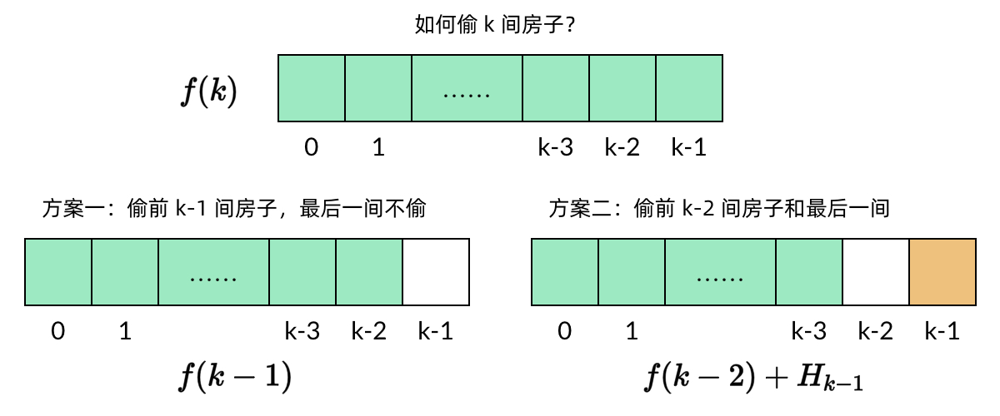
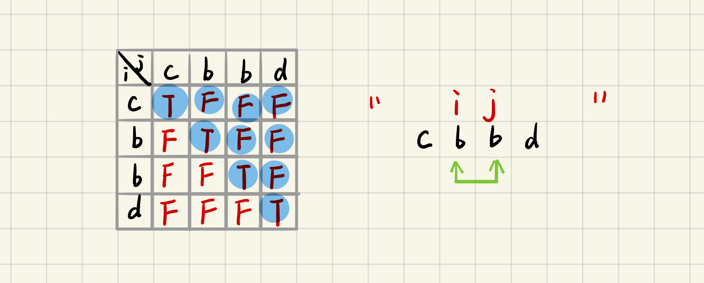

## 面试题08.01 三步问题 [dp] [easy]
1. https://leetcode-cn.com/problems/three-steps-problem-lcci/

2. code:
```js

```

3. 变形: 相邻的步伐不能相同
```js

```

# 不同路径 系列 - 3

## 62. 不同路径
1. https://leetcode-cn.com/problems/unique-paths/
2. 题目: 一个机器人位于一个 m x n 网格的左上角; 机器人每次只能向下或者向右移动一步。机器人试图达到网格的右下角。问总共有多少条不同的路径？
3. 思路:
+ 思路1
  + dp[i][j] 是到达 (i,j) 的最多路径
  + 动态方程: dp[i][j] = dp[i-1][j] + dp[i][j-1];
  + 边界: dp[0][j]=1; d[i][0] = 1;
  + 时间复杂度: O(m*n)

+ 优化: 
 vec[i] = vec[i-1] + vec[i];


4. 代码: 
```js
  var uniquePaths = function(m,n) {
    let cur = new Array(n).fill(1);
    for(let i = 1; i < m; i++) {
      for(let j = 1; j < n; j++) {
        cur[j] = cur[j-1] + cur[j]
      }
    }
    return cur[n-1];
  }

```

+ 注意:
  + js中的二维数组


5. 刷题记录

|  时间   | 次数  | 备注  |   |
| :---- | :----: | :---- |:----: |
| 08.10  |   1  | dp | 1|
| 08.10  |   1  | dp | 1|

## 63. 不同路径II
1. https://leetcode-cn.com/problems/unique-paths-ii/
2. 题目: 网格中的障碍物: 1, 空位置: 0;
3. 思路:
+ 如果网格 (i,j) 上有障碍物，则 dp[i][j] 值为 0，表示走到该格子的方法数为 0；
+ 否则网格 (i,j) 可以从网格 (i−1,j) 或者 网格 (i,j−1) 走过来，因此走到该格子的方法数为走到网格(i−1,j) 和网格 (i,j−1) 的方法数之和，即 dp[i, j] = dp[i - 1, j] + dp[i, j - 1]

4. 代码: 
```js
var uniquePathsWithObstacles = function(obstacleGrid) {

  var m = obstacleGrid.length;
  var n = obstacleGrid[0].length;

  let result = new Array(n).fill(0);
  result[0] = 1;

  for(let i=0; i < m; i++) {
      for(let j=0; j < n; j++) {
          if(obstacleGrid[i][j] == 1){
              result[j] = 0;
          }else if(j>0) {
              result[j] += result[j-1]
          }
          
      }
  }
  return result[n-1]
};
```
5. 刷题记录

|  时间   | 次数  | 备注  |   |
| :---- | :----: | :---- |:----: |
| 08.10  |   1  | dp | 1|
| 08.10  |   1  | dp | 1|
| 08.11  |   1  | dp | 1|


## 64. 不同路径III [hard]
1. https://leetcode-cn.com/problems/unique-paths-iii/
2. 题目: 
+ 
+ 示例:
```

```

3. 思路:
+ 

4. 代码: 
```js

```
5. 刷题记录

|  时间   | 次数  | 备注  |   |
| :---- | :----: | :---- |:----: |
| 08.11  |   1  | dp | 1|


# 120. 三角形最小路径和
1. https://leetcode-cn.com/problems/triangle/description/
2. 题目:
+ 给定一个三角形，找出自顶向下的最小路径和。每一步只能移动到下一行中相邻的结点上。
+ 相邻的结点 在这里指的是 下标 与 上一层结点下标 相同或者等于 上一层结点下标 + 1 的两个结点。 
```
[
     [2],
    [3,4],
   [6,5,7],
  [4,1,8,3]
]
//自顶向下的最小路径和为 11（即，2 + 3 + 5 + 1 = 11）。
//相邻结点：与(i, j) 点相邻的结点为 (i + 1, j) 和 (i + 1, j + 1)。
```
3. 思路:

+ dp[i][j]: 从点(i, j) 到底边的最小路径和
+ dp方程(自底向上) : dp[i][j] = min(dp[i+1][j], dp[i+1][j+1]) + triangle[i][j]

4. 代码: 
+ 自底向上
```js


```
+ 自底向上 + 空间优化(降维)
```js
var dp = new Array(triangle.length+1).fill(0);
for(var i = triangle.length-1;i >= 0;i--){
  //是 triangle[i]
  for(var j = 0;j < triangle[i].length;j++){
      dp[j] = Math.min(dp[j],dp[j+1]) + triangle[i][j];
  }
}
return dp[0];
```

5. 刷题记录

|  时间   | 次数  | 备注  |   |
| :---- | :----: | :---- |:----: |
| 08.10  |   1  | dp | 1|


# 1143. 最长公共子序列
1. https://leetcode-cn.com/problems/longest-common-subsequence/
2. 示例:
```
输入：text1 = "abcde", text2 = "ace" 
输出：3  
解释：最长公共子序列是 "ace"，它的长度为 3。
```
3. 思路:
+ 例如：s1="abcde", s2= "ace"，求两个字符串的公共子序列，答案是“ace”
+ S{s1,s2,s3....si},  T{t1,t2,t3,t4....tj}
+ 子问题划分
  - 如果S的最后一位等于T的最后一位，则最大子序列就是{s1,s2,s3...si-1}和{t1,t2,t3...tj-1}的最大子序列+1
  - 如果S的最后一位不等于T的最后一位，那么最大子序列就是 以下两个自序列的最大值
    - {s1,s2,s3..si}和 {t1,t2,t3...tj-1} 最大子序列
    - {s1,s2,s3...si-1} 和 {t1,t2,t3....tj} 最大子序列
+ 边界
  - 只剩下{s1}和{t1}，如果相等就返回1，不等就返回0
+ 使用一个表格来存储dp的结果
  - 如果 S[i] == T[j],  则dp[i][j] = dp[i-1][j-1] + 1
  - 否则 dp[i][j] = max(dp[i][j-1],dp[i-1][j])


4. 代码: 
```js
// new Array , arr[m+1][n+1]
// for() {for() {}}
// dp function:
  // 1. if( s[i-1]== t[j-1]) (比叫从 s[0], t[0])
    //dp[i][j] = dp[i-1][j-1] + 1
  // 2. else   dp[i][j] = max(dp[i][j-1],dp[i-1][j])
```
5. 刷题记录

|  时间   | 次数  | 备注  |   |
| :---- | :----: | :---- |:----: |
| 08.11  |   1  | dp | 1|


# 53. 最大子序和 [精妙]
1. https://leetcode-cn.com/problems/maximum-subarray/
2. 题目: 
+ 给定一个整数数组 nums ，找到一个具有最大和的连续子数组（子数组最少包含一个元素），返回其最大和。
+ 示例:
```
输入: [-2,1,-3,4,-1,2,1,-5,4]
输出: 6
解释: 连续子数组 [4,-1,2,1] 的和最大，为 6。
```
3. 代码: 
```js
  var maxSubArray = function(m, n) {
    let ans = nums[0];
    let sum = 0;
    for(const num of nums) {
        if(sum > 0) {
            sum += num;
        } else {
            sum = num;
        }
        ans = Math.max(ans, sum);
    }
    return ans;
  }
```

4. 刷题记录

|  时间   | 次数  | 备注  |   |
| :---- | :----: | :---- |:----: |
| 08.11  |   1  | dp | 1|

# 152. 乘积最大子数组 [考虑负负得正的情况]
1. https://leetcode-cn.com/problems/maximum-product-subarray/description/
2. 题目: 
+ 给你一个整数数组 nums ，请你找出数组中乘积最大的连续子数组（该子数组中至少包含一个数字），并返回该子数组所对应的乘积
+ 示例:
```
输入: [2,3,-2,4]
输出: 6
解释: 子数组 [2,3] 有最大乘积 6。
```

3. 思路:
+ 不要忽略 [负负得正]
+ 把 dp[j−1] 直接拿过来相乘，不一定是局部最优解
  - 如果 j 项是负数，则 dp[j−1] 是最大积，得到 dp[j] 会是最小的。此时 j−1 的最优解应当是负数的最大，即最小积
  - 如果 j 项是正数，把前面的最大积直接拿来乘. 即，对 j 来说 j−1 的最优解可能是最大积，也可能是最小乘积
+ 因此，dp[i] 要放两项了，一项是局部最大积，一项是局部最小积
  - dp[i][0]： 从第 0 项到第 i 项范围内的子数组的最小乘积
  - dp[i][1]： 从第 0 项到第 i 项范围内的子数组的最大乘积
+ base case：
  - dp[0][0] = nums[0]
  - dp[0][1] = nums[0]
+ 对于以 i 项为末尾项的子数组能产生的最小积，它有 3 种情况：
  - 不和别人乘，就它自己
  - 自己是负数，希望乘上前面的最大积
  - 自己是正数，希望乘上前面的最小积
+ 所以，dp[i][0] 取三种情况中的最小值
  - dp[i][0] = min( dp[i - 1][0] * nums[i], dp[i - 1][1] * nums[i], nums[i])
+ 类似的，dp[i][1] 值取三种情况中的最大值
  - dp[i][1] = max( dp[i - 1][0] * nums[i], dp[i - 1][1] * nums[i], nums[i])


4. 代码: 
```js
let max = nums[0], min = nums[0], res = nums[0];
for() {
  let tmp = min;
  min = Math.min(nums[i], Math.min(max * nums[i], min * nums[i])); 
  max = Math.max(nums[i], Math.max(max * nums[i], tmp * nums[i])); 
  res = Math.max(res, max);
}

```
5. 刷题记录

|  时间   | 次数  | 备注  |   |
| :---- | :----: | :---- |:----: |
| 08.11  |   1  | dp | 1|


# 实战题目 [08.11]

# 打家劫舍 系列 -2

## 198. 打家劫舍
1. https://leetcode-cn.com/problems/house-robber/
2. 题目: 
+ 如果两间相邻的房屋在同一晚上被小偷闯入，系统会自动报警
+ 给定一个代表每个房屋存放金额的非负整数数组，计算你 不触动警报装置的情况下 ，一夜之内能够偷窃到的最高金额。
+ 示例:
```
输入：[1,2,3,1]
输出：4
解释：偷窃 1 号房屋 (金额 = 1) ，然后偷窃 3 号房屋 (金额 = 3)。
     偷窃到的最高金额 = 1 + 3 = 4 。
```

3. 思路: 
+ pic:

+ 时间复杂度：O(n)，n 为数组长度

+ dp function: dp[n] = Max(dp[n-1], dp[n-2]+num[n-1] )

4. 代码: 
```js

```
5. 刷题记录

|  时间   | 次数  | 备注  |   |
| :---- | :----: | :---- |:----: |
| 08.11  |   1  | dp | 1|


## 213. 打家劫舍 I
1. https://leetcode-cn.com/problems/house-robber-ii/description/
2. 题目: 
+ 这个地方所有的房屋都<u>围成一圈</u>，这意味着[第一个房屋和最后一个房屋是紧挨着的]。同时，相邻的房屋装有相互连通的防盗系统，如果两间相邻的房屋在同一晚上被小偷闯入，系统会自动报警。
+ 示例:
```
输入: [2,3,2]
输出: 3
解释: 你不能先偷窃 1 号房屋（金额 = 2），然后偷窃 3 号房屋（金额 = 2）, 因为他们是相邻的。

输入: [1,2,3,1]
输出: 4
解释: 你可以先偷窃 1 号房屋（金额 = 1），然后偷窃 3 号房屋（金额 = 3）。
     偷窃到的最高金额 = 1 + 3 = 4 。

```

3. 思路: 
+ 与版本1的区别：变为循环数组。本质思路是相同的
+ 变成环形数组，其实只增加了一个限制条件，就是头尾相邻，即不能同时偷nums[0]和nums[n-1]. 所以我们可以进行两次遍历：
  - 遍历nums[0 ~ n-2]，表示考虑nums[0]而不考虑nums[n-1]
  - 遍历nums[1 ~ n-1]，表示考虑nums[n-1]而不考虑nums[0]
  - 最后取更大者就行了。
+ 另外，需要注意n === 1的情况，可能需要单独处理。


4. 代码: 
```js
var rob = function(nums) {
  const n = nums.length;
  if (n === 1) return nums[0];
  return Math.max(
    robbing(nums.slice(0, n - 1)),
    robbing(nums.slice(1, n))
  );
}
// function robbing refers to I
```
5. 刷题记录

|  时间   | 次数  | 备注  |   |
| :---- | :----: | :---- |:----: |
| 08.11  |   1  | dp | 1|


# 买卖股票 系列 - 7 [08.12]
refer to: https://leetcode-cn.com/problems/best-time-to-buy-and-sell-stock/solution/yi-ge-fang-fa-tuan-mie-6-dao-gu-piao-wen-ti-by-l-3/

refert to: https://leetcode-cn.com/problems/best-time-to-buy-and-sell-stock-iii/solution/mai-mai-gu-piao-zui-jia-shi-ji-6dao-ti-jie-by-xi-5/

## 题目列表
+ 买卖股票的最佳时机 [只进行一次交易，相当于 k = 1]
+ 买卖股票的最佳时机 II [不限交易次数，相当于 k = +infinity（正无穷）]
+ 买卖股票的最佳时机 III [只进行 2 次交易，相当于 k = 2]
<!-- + 买卖股票的最佳时机 IV -->
+ 最佳买卖股票时机含冷冻期 [不限次数] [冷冻期] [II的变种]
+ 买卖股票的最佳时机含手续费 [不限次数] [手续费] [II的变种]


## 121. 买卖股票的最佳时机 [最多完成一笔交易]
1. https://leetcode-cn.com/problems/best-time-to-buy-and-sell-stock/#/description
2. 题目: 
+ 给定一个数组，它的第 i 个元素是一支给定股票第 i 天的价格。如果你最多只允许完成一笔交易（即买入和卖出一支股票一次），设计一个算法来计算你所能获取的最大利润。
+ 示例:
```
输入: [7,1,5,3,6,4]
输出: 5
解释: 在第 2 天（股票价格 = 1）的时候买入，在第 5 天（股票价格 = 6）的时候卖出，最大利润 = 6-1 = 5. 注意利润不能是 7-1 = 6, 因为卖出价格需要大于买入价格；同时，你不能在买入前卖出股票。
```
3. 思路: 
+ 

4. 代码: 
```js

```
5. 刷题记录

|  时间   | 次数  | 备注  |   |
| :---- | :----: | :---- |:----: |
| 08.11  |   1  | dp | 1|


## 122. 买卖股票的最佳时机 II [尽可能完成更多交易]
1. https://leetcode-cn.com/problems/best-time-to-buy-and-sell-stock-ii/
2. 题目: 
+ 设计一个算法来计算你所能获取的最大利润。你可以尽可能地完成更多的交易（多次买卖一支股票）。
+ 示例:
```
输入: [7,1,5,3,6,4]
输出: 7
解释: 在第 2 天（股票价格 = 1）的时候买入，在第 3 天（股票价格 = 5）的时候卖出, 这笔交易所能获得利润 = 5-1 = 4 。
     随后，在第 4 天（股票价格 = 3）的时候买入，在第 5 天（股票价格 = 6）的时候卖出, 这笔交易所能获得利润 = 6-3 = 3 。
```
3. 思路: 
+ 贪心算法，每天为一步，只取正收益， 负收益不要（设为0）。而每一天的收益 = 今天股价 - 昨天的股价。
（看了不少人的题解都需要判断数组长度等于0、1的情况，其实直接从1开始循环即可，不用判断）

4. 代码: 
```js
var maxProfit = function(prices) {
    let sum = 0
    for(let i=1; i<prices.length; i++) {
        sum += Math.max(prices[i] - prices[i-1], 0)
    }
    return sum
};

```

## 123. 买卖股票的最佳时机 III [最多2笔交易] [hard]
1. https://leetcode-cn.com/problems/best-time-to-buy-and-sell-stock-iii/
2. 题目: 
+ 设计一个算法来计算你所能获取的最大利润。你最多可以完成 两笔 交易。注意: 你不能同时参与多笔交易（你必须在再次购买前出售掉之前的股票）
+ 示例:
```
输入: [1,2,3,4,5]
输出: 4
解释: 在第 1 天（股票价格 = 1）的时候买入，在第 5 天 （股票价格 = 5）的时候卖出, 这笔交易所能获得利润 = 5-1 = 4 。   
     注意你不能在第 1 天和第 2 天接连购买股票，之后再将它们卖出。   
     因为这样属于同时参与了多笔交易，你必须在再次购买前出售掉之前的股票。
```
3. 思路: 
+ 

4. 代码: 
```js
var maxProfit = function(prices) {
    //第一次 买入， 卖出的利润
    let profit_1_in = -prices[0], profit_1_out = 0;
    //继第一次之后，第二次买入卖出的利润
    let profit_2_in = -prices[0], profit_2_out = 0;
    let n = prices.length;
    for (let i = 1; i < n; i++){
        profit_2_out = Math.max(profit_2_out, profit_2_in + prices[i]);
        //第二次买入后的利润， 第一次卖出的利润 - prices[i]
        profit_2_in = Math.max(profit_2_in, profit_1_out - prices[i]);
        profit_1_out = Math.max(profit_1_out, profit_1_in + prices[i]);
        //第一次买入后，利润为 -prices[i]
        profit_1_in = Math.max(profit_1_in, -prices[i]);
    }
    return profit_2_out;
};


```

## 188. 买卖股票的最佳时机 IV
1. https://leetcode-cn.com/problems/best-time-to-buy-and-sell-stock-iv/
2. 题目: 
+ 你最多可以完成 k 笔交易
+ 示例:
```

```
3. 思路: 
+ 

4. 代码: 
```js
var maxProfit = function(k, prices) {
    let n = prices.length;
    if (k > n / 2) {
        k = Math.floor(n/2);  //这样也可以，但其实增加了时间复杂度和内存消耗
        // return maxProfit_k_infinity(prices); //也可以
    }
    let profit = new Array(k);
    //初始化买入卖出时的利润
    for (let j = 0; j <= k; j++){
        profit[j] = {
            profit_in: -prices[0],
            profit_out: 0
        };
    }
    for (let i = 0; i < n; i++){
        for (let j = 1; j <= k; j++){
            profit[j] = {
                profit_out: Math.max(profit[j].profit_out, profit[j].profit_in + prices[i]), 
                profit_in: Math.max(profit[j].profit_in, profit[j-1].profit_out - prices[i])
            }
        }
    }
    return profit[k].profit_out;
};


```
5. 刷题记录

|  时间   | 次数  | 备注  |   |
| :---- | :----: | :---- |:----: |
| 08.11  |   1  | dp | 1|


## 309. 最佳买卖股票时机含冷冻期
1. https://leetcode-cn.com/problems/best-time-to-buy-and-sell-stock-with-cooldown/
2. 题目: 
+ 
+ 示例:
```

```
3. 思路: 
+ 

4. 代码: 
```js
var maxProfit = function(prices) {
    let n = prices.length;
    let profit_in = 0 - prices[0];
    let profit_out = 0;
    //冻结时的利润
    let profit_freeze = 0;
    for (let i = 1; i < n; i++){
        let temp = profit_out;
        profit_out = Math.max(profit_out, profit_in + prices[i]);
        //买入时的利润= 上次冻结时的利润 - 当天价格
        profit_in = Math.max(profit_in, profit_freeze - prices[i]);
        //冻结时的利润 = 上次卖出时的利润
        profit_freeze = temp;
    }
    return profit_out;
};

```

## 714. 买卖股票的最佳时机含手续费
1. https://leetcode-cn.com/problems/best-time-to-buy-and-sell-stock-with-transaction-fee/
2. 题目: 
+ 
+ 示例:
```

```
3. 思路: 
+ 

4. 代码: 
```js
var maxProfit = function(prices, fee) {
    //初始利润
    var profit_in = 0 - prices[0];
    var profit_out = 0;
    for (let i = 1; i < prices.length; i++){
        ////卖出： 当前买入状态时的利润 + 卖出的股票 - 手续费
        profit_out = Math.max(profit_out ,profit_in + prices[i] - fee); 
        //买入： 当前卖出时的利润 - 买进的股票
        profit_in = Math.max(profit_in ,profit_out - prices[i]);     
    }
    return profit_out;
};

```
5. 刷题记录

|  时间   | 次数  | 备注  |   |
| :---- | :----: | :---- |:----: |
| 08.11  |   1  | dp | 1|


#3 53. 最大子序和 [精妙]
1. https://leetcode-cn.com/problems/maximum-subarray/
2. 题目: 
+ 
+ 示例:
```

```
3. 思路: 
+ 

4. 代码: 
```js

```
5. 刷题记录

|  时间   | 次数  | 备注  |   |
| :---- | :----: | :---- |:----: |
| 08.11  |   1  | dp | 1|


# 高级DP实战题目 [08.11]

# 距离-平方数 系列 - 2

## 279. 完全平方数
1. https://leetcode-cn.com/problems/perfect-squares/
2. 题目: 
+ 给定正整数 n，找到若干个完全平方数（比如 1, 4, 9, 16, ...）使得它们的和等于 n。你需要让组成和的完全平方数的个数最少。
+ 示例:
```
输入: n = 12
输出: 3 
解释: 12 = 4 + 4 + 4.
```

3. 思路:
+ 其实这道题就是 coin change 问题，可以先找到自己的coins，即找到小于等于这个数的所有平方数集合，然后就是用最少的coins来凑target了
+ 首先初始化长度为n+1的数组dp，每个位置都为0
+ 如果n为0，则结果为0
+ 对数组进行遍历，下标为i，每次都将当前数字先更新为最大的结果，即dp[i]=i，比如i=4，最坏结果为4=1+1+1+1, 即为4个数字
+ 动态转移方程为：dp[i] = MIN(dp[i], dp[i - j * j] + 1)，i表示当前数字，j*j表示平方数
+ 时间复杂度：O(n*sqrt(n))，sqrt为平方根


4. 代码: 
```js
var numSquares = function(n) {
  const dp = [...Array(n+1)].map(_=>0); // 数组长度为n+1，值均为0
  for (let i = 1; i <= n; i++) {
      dp[i] = i; // 最坏的情况就是每次+1
      for (let j = 1; i - j * j >= 0; j++) { 
          dp[i] = Math.min(dp[i], dp[i - j * j] + 1); // 动态转移方程
      }
  }
  return dp[n];
};


```
5. 刷题记录

|  时间   | 次数  | 备注  |   |
| :---- | :----: | :---- |:----: |
| 08.11  |   1  | dp | 1|

## 72. 编辑距离 [重点] [hard]
1. https://leetcode-cn.com/problems/edit-distance/
2. 题目: 
+ 
+ 示例:
```

```

3. 思路:
+ 

4. 代码: 
```js

```
5. 刷题记录

|  时间   | 次数  | 备注  |   |
| :---- | :----: | :---- |:----: |
| 08.11  |   1  | dp | 1|


# 零钱兑换 系列 - 2

## 322. 零钱兑换
1. https://leetcode-cn.com/problems/coin-change/description/
2. 题目: 给定不同面额的硬币 coins 和一个总金额 amount。编写一个函数来计算可以凑成总金额所需的最少的硬币个数。如果没有任何一种硬币组合能组成总金额，返回 -1。
```
输入: coins = [1, 2, 5], amount = 11
输出: 3 
解释: 11 = 5 + 5 + 1
```
3. dp方程: dp[i]= Math.min([1+dp[11-coin[0]], [1+dp[11-coin[1]], [1+dp[11-coin[2]]);
+ dp[i] = Math.min(dp[i], dp[i-coin]+1);
代码: 
```js
  var coinChange = function(coins, amount) {
    let dp = new Array(amount+1).fill(amount+1);
    
    dp[0][0] = 0;

    for(let i = 1; i <= amount; i++) {
      for(let coin of coins) {
        dp[i] = Math.min(dp[i], dp[i - coin]+1);
      }
    }
    return dp[amount] == dp[amount+1] ? -1: dp[amount];
  }
```

4. 刷题记录

|  时间   | 次数  | 备注  |   |
| :---- | :----: | :---- |:----: |
| 08.10  |   1  | dp | 1|
| 08.10  |   1  | dp | 1|
| 08.10  |   1  | dp | 1|


## 518. 零钱兑换 II  [interest] [TODO]
1. https://leetcode-cn.com/problems/coin-change-2/
2. 题目: 
+ 给定不同面额的硬币和一个总金额。写出函数来计算可以凑成总金额的硬币组合数。假设每一种面额的硬币有无限个。
+ 示例:
```
输入: amount = 5, coins = [1, 2, 5]
输出: 4
解释: 有四种方式可以凑成总金额:
5=5
5=2+2+1
5=2+1+1+1
5=1+1+1+1+1
```

3. 思路:
+ 推荐:  https://leetcode-cn.com/problems/coin-change-2/solution/dong-tai-gui-hua-wan-quan-bei-bao-wen-ti-by-liweiw/
+ dp[i][j]：硬币列表的前缀子区间 [0, i] 能够凑成总金额 j 的组合数
```
dp[i][j] = dp[i - 1][j - 0 * coins[i]] + 
           dp[i - 1][j - 1 * coins[i]] +
           dp[i - 1][j - 2 * coins[i]] + 
           ... + 
           dp[i - 1][j - k * coins[i]]
```
+ 优化dp
```
dp[i][j] = dp[i - 1][j] + dp[i][j - coins[i]]
dp[i] = dp[i] + dp[i - coins[j]];
```

4. 代码: 

```js
//空间优化后
var change = function(amount, coins) {
  if (amount === 0) return 1;

  const dp = [1].concat(Array(amount).fill(0)); //cool

  for (let j = 0; j < coins.length; j++) {
    for (let i = 1; i < amount + 1; i++) {
      if (i - coins[j] >= 0) {
        dp[i] = dp[i] + dp[i - coins[j]];
      }
    }
  }

  return dp[dp.length - 1];
```
5. 刷题记录

|  时间   | 次数  | 备注  |   |
| :---- | :----: | :---- |:----: |
| 08.11  |   1  | dp | 1|


# 跳跃游戏 系列 - 2

## 55. 跳跃游戏
1. https://leetcode-cn.com/problems/jump-game/
2. 题目:
+  数组中的每个元素代表你在该位置可以跳跃的最大长度。判断你是否能够到达最后一个位置
+ 示例:
```
输入: [2,3,1,1,4]
输出: true
解释: 我们可以先跳 1 步，从位置 0 到达 位置 1, 然后再从位置 1 跳 3 步到达最后一个位置。
```

3. 思路:
+ 贪心
+ dp


4. 代码: 
+ 贪心
```js
// nums[i] + i >= pos
// update pos=i
```
5. 刷题记录

|  时间   | 次数  | 备注  |   |
| :---- | :----: | :---- |:----: |
| 08.11  |   1  | dp | 1|


## 45. 跳跃游戏II [hard] [可跳范围内选择可以使得跳的更远的位置]
1. https://leetcode-cn.com/problems/jump-game-ii/
2. 题目: 
+ 使用最少的跳跃次数到达数组的最后一个位置
+ 示例:
```
输入: [2,3,1,1,4]
输出: 2
解释: 跳到最后一个位置的最小跳跃数是 2。
     从下标为 0 跳到下标为 1 的位置，跳 1 步，然后跳 3 步到达数组的最后一个位置
```

3. 思路:
+ 贪婪算法
  - from left to right: 每次在可跳范围内选择可以使得跳的更远的位置
  - from right to left: 
+ 图解:
>  
>  
4. 代码: 
```js
for(int i = 0; i < nums.length - 1; i++){
    maxPosition = Math.max(maxPosition, nums[i] + i); 
    //遇到边界，就更新边界，并且步数加一
    if( i == end){
      end = maxPosition;
      steps++;
    }
  }
```
5. 刷题记录

|  时间   | 次数  | 备注  | 时间复杂度   |
| :---- | :----: | :---- |:----: |
| 08.12  |   1   | dp    | O(n)  |


# 作业 [08.14 Friday]

## 64. 最小路径和 [easy]
1. https://leetcode-cn.com/problems/minimum-path-sum/
2. 题目: 
+ 给定一个包含非负整数的 m x n 网格，请找出一条从左上角到右下角的路径，使得路径上的数字总和为最小
+ 示例:
```
输入:
[
  [1,3,1],
  [1,5,1],
  [4,2,1]
]
输出: 7
解释: 因为路径 1→3→1→1→1 的总和最小。

```

3. 思路:
+ dp[i][j] 表示从左上角出发到 (i,j) 位置的最小路径和
+ dp[0][0]=grid[0][0];
+ i>0 && j=0: dp[i][0]=dp[i−1][0]+grid[i][0]; 
+ i=0 && j>0: dp[0][j]=dp[0][j−1]+grid[0][j];
+ i>0 && j>0: dp[i][j]=min(dp[i−1][j],dp[i][j−1])+grid[i][j]。
+ dp[m−1][n−1] 的值即为从网格左上角到网格右下角的最小路径和。

4. 代码: 
```js
//按照思路写代码就可以了
```
5. 刷题记录

|  时间   | 次数  | 备注  |   |
| :---- | :----: | :---- |:----: |
| 08.11  |   1  | dp | 1|
| 08.14  |   1  | dp | 1|

## 91. 解码方法 [边界条件] [还是不太理解dp方程]
1. https://leetcode-cn.com/problems/decode-ways/
2. 题目: 
+ 一条包含字母 A-Z 的消息通过以下方式进行了编码：
```
    'A' -> 1
    'B' -> 2
    ...
    'Z' -> 26
```
+ 给定一个只包含数字的非空字符串，请计算[解码方法的总数]。

3. 示例:
```
输入: "12"
输出: 2
解释: 它可以解码为 "AB"（1 2）或者 "L"（12）。

输入: "226"
输出: 3
解释: 它可以解码为 "BZ" (2 26), "VF" (22 6), 或者 "BBF" (2 2 6) 。
```

4. 思路:
+ 总结题目: 根据一个字符串结尾的两个字符(暂不讨论边界问题),推导dp. 
+ dp[i] 为 str[0..i]的译码方法总数
+ 译码方法分2种 (需要理解):
  + s[i-1]与s[i]分开译码, 为dp[i-1]
  + s[i-1]与s[i]合并译码, 为dp[i-2]

+ 难点: 边界条件
+ 类似 [爬楼梯]

5. 分情况讨论:
  + 一位数 X, 1
  + 两位数 XX: 比如 "12"(开头是1), 分开译码+合并译码
  + 两位数 XX: 比如 "24"(在21~26之间), 分开译码+合并译码
+ s[i] = '0', 如果 s[i-1]='1'或'2' ("20"), 则dp[i]=dp[i-2] (合并译码); 否则return 0 (比如 "03")
+ s[i-1] = '1': dp[i] = dp[i-1] + dp[i-2]
+ s[i-2] = '2' && '1'<=s[i]<='6' (在21-26之间), dp[i] = dp[i-1] + dp[i-2]


6. 刷题记录

|  时间   | 次数  | 备注  |   |
| :---- | :----: | :---- |:----: |
| 08.11  |   1  | dp | 1|


## 221. 最大正方形 [有趣] [最小边长]
1. https://leetcode-cn.com/problems/maximal-square/
2. 题目: 
+ 在一个由 0 和 1 组成的二维矩阵内，找到只包含 1 的最大正方形，并返回其面积。
+ 示例:
```
输入: 

1 0 1 0 0
1 0 1 1 1
1 1 1 1 1
1 0 0 1 0

输出: 4

```

3. 思路:
+ 考虑使用动态规划，我们使用dp[i][j]表示以 matrix[i][j] 为右下角的顶点的可以组成的最大正方形的边长。那么我们只需要计算所有的i，j组合，然后求出最大值即可
+ dp fun: dp[i][j] = Min(dp[i - 1][j - 1], dp[i - 1][j], dp[i][j - 1]) + 1;
+ new Array[row+1][col+1]
> 

4. 代码: 
```js

```
5. 刷题记录

|  时间   | 次数  | 备注  |   |
| :---- | :----: | :---- |:----: |
| 08.12  |   1  | dp | 1|


## 621. 任务调度器 [hard to understand]
1. https://leetcode-cn.com/problems/task-scheduler/
2. 题目: 
+ 
+ 示例:
```

```

3. 思路:
+ 参考 
+ 最短时间会有两种情况：
  - 执行过程中没有待命的情况发生，即所有任务连续执行，没有停顿，那么最短时间即为任务总数
  - 执行过程中出现了待命状态，那么最短时间需要将待命状态计算在内。
+ 

4. 代码: 
```js

```
5. 刷题记录

|  时间   | 次数  | 备注  |   |
| :---- | :----: | :---- |:----: |
| 08.11  |   1  | dp | 1|


## 647. 回文子串 [有趣] [dp table??]
1. https://leetcode-cn.com/problems/palindromic-substrings/
2. 题目: 
+ 给定一个字符串，你的任务是计算这个字符串中有多少个回文子串。具有不同开始位置或结束位置的子串，即使是由相同的字符组成，也会被计为是不同的子串
+ 示例:
```
输入: "abc"
输出: 3
解释: 三个回文子串: "a", "b", "c".

输入: "aaa"
输出: 6
说明: 6个回文子串: "a", "a", "a", "aa", "aa", "aaa".
```

3. 思路:
+ 如果s[i]==s[j], 说明只要dp[i+1][j-1]是回文子串，dp[i][j]也就是回文子串
> 
+ 边界: 因为当计算dp[i][j]dp[i][j]的时候，中间已经没有dp[i+1][j-1]dp[i+1][j−1]了
> 

4. 代码: 
```js

```
5. 刷题记录

|  时间   | 次数  | 备注  |   |
| :---- | :----: | :---- |:----: |
| 08.14  |   1  | dp | 1|

# [08.14/15 hard tasks] 

## 32. 最长有效括号 [原来dp可以这样?? ] [s[i-dp[i-1] - 1] ????]
1. https://leetcode-cn.com/problems/longest-valid-parentheses/
2. 题目: 
+ 给定一个只包含 '(' 和 ')' 的字符串，找出最长的包含有效括号的子串的长度
+ 示例:
```
输入: "(()"
输出: 2
解释: 最长有效括号子串为 "()"

输入: ")()())"
输出: 4
解释: 最长有效括号子串为 "()()"
```

3. 思路:
+  dp[i] 表示以 i 结尾的最长有效括号；
+  当 s[i] 为 (, dp[i] 必然等于 0，因为不可能组成有效的括号；
+  当 s[i] 为 )
  - 当 s[i-1] 为 (, 那么 dp[i] = dp[i-2] + 2 (ok)
  - 当 s[i-1] 为 ) &&  s[i-dp[i-1] - 1] 为 (, 那么 dp[i] = dp[i-1] + 2 + dp[i-dp[i-1]-2] (not understand)
   - s[i-dp[i-1] - 1] , 在前面的某个位置上有个 (, 则与后面的) 会成为2
   - ???


4. 代码: 
```js

```
5. 刷题记录

|  时间   | 次数  | 备注  |   |
| :---- | :----: | :---- |:----: |
| 08.14  |   1  | dp | 1|

## 72. 编辑距离 [推荐学习] [有趣] [经典]
1. https://leetcode-cn.com/problems/edit-distance/
2. 题目: 
+ 给你两个单词 word1 和 word2，请你计算出将 word1 转换成 word2 所使用的最少操作数 。
+ 你可以对一个单词进行如下三种操作：
  - 插入一个字符
  - 删除一个字符
  - 替换一个字符  
+ 示例:
```
  输入：word1 = "horse", word2 = "ros"
  输出：3
  解释：
  horse -> rorse (将 'h' 替换为 'r')
  rorse -> rose (删除 'r')
  rose -> ros (删除 'e')

```

3. 解法推荐:
+ 推荐: https://leetcode-cn.com/problems/edit-distance/solution/dong-tai-gui-hua-java-by-liweiwei1419/
+ 推荐: https://leetcode-cn.com/problems/edit-distance/solution/zi-di-xiang-shang-he-zi-ding-xiang-xia-by-powcai-3/
+ https://leetcode-cn.com/problems/edit-distance/solution/edit-distance-by-ikaruga/


4. 思路 (经典):
+ dp[i][j] 代表 word1 到 i 位置转换成 word2 到 j 位置需要最少步数
+ 当 word1[i] == word2[j]，dp[i][j] = dp[i-1][j-1]；
+ 当 word1[i] != word2[j]，dp[i][j] = min(dp[i-1][j-1], dp[i-1][j], dp[i][j-1]) + 1
  - 插入: dp[i][j-1]
  - 删除: dp[i-1][j]
  - 替换: dp[i-1][j-1]
  - 按顺序计算，当计算 dp[i][j] 时，dp[i - 1][j] ， dp[i][j - 1] ， dp[i - 1][j - 1] 均已经确定了
  - 配合增删改这三种操作，需要对应的 dp 把操作次数加一，取三种的最小
+ 注意，针对第一行，第一列要单独考虑，我们引入 '' 下图所示[考虑 word1 或 word2 一个字母都没有，即全增加/删除的情况，所以预留 dp[0][j] 和 dp[i][0]]
+ 
  - 第一行，是 word1 为空变成 word2 最少步数，就是插入操作
  - 第一列，是 word2 为空，需要的最少步数，就是删除操作

5. 补充(参考):
+ 当word1[i]==word2[j]时,由于遍历到了i和j,说明word1的0~i-1和word2的0~j-1的匹配结果已经生成,
由于当前两个字符相同,因此无需做任何操作,dp[i][j]=dp[i-1][j-1]
+ 当word1[i]!=word2[j]时,可以进行的操作有3个:
  + 替换操作:可能word1的0~i-1位置与word2的0~j-1位置的字符都相同,
    只是当前位置的字符不匹配,进行替换操作后两者变得相同,
    所以此时dp[i][j]=dp[i-1][j-1]+1(这个加1代表执行替换操作)
  + 删除操作:若此时word1的0~i-1位置与word2的0~j位置已经匹配了,
      此时多出了word1的i位置字符,应把它删除掉,才能使此时word1的0~i(这个i是执行了删除操作后新的i)
      和word2的0~j位置匹配,因此此时dp[i][j]=dp[i-1][j]+1(这个加1代表执行删除操作)
  + 插入操作:若此时word1的0~i位置只是和word2的0~j-1位置匹配,
      此时只需要在原来的i位置后面插入一个和word2的j位置相同的字符使得
      此时的word1的0~i(这个i是执行了插入操作后新的i)和word2的0~j匹配得上,
      所以此时dp[i][j]=dp[i][j-1]+1(这个加1代表执行插入操作)
  + 由于题目所要求的是要最少的操作数:所以当word1[i] != word2[j] 时,
      需要在这三个操作中选取一个最小的值赋格当前的dp[i][j]
+ 总结:状态方程为:
if(word1[i] == word2[j]):
  dp[i][j] = dp[i-1][j-1]
else:
  min(dp[i-1][j-1],dp[i-1][j],dp[i][j-1])+1

+ PS:大佬的代码中word1.charAt(i-1)==word2.charAt(j-1)的原因是:
     初始化DP Table时dp[i][0]和dp[0][j]已经填写完成,所以接下来填表需要从1开始,
     但是字符的比较需要从0开始,因此才这样子写

6. 代码: 
```js
if(word1[i] == word2[j]):
  dp[i][j] = dp[i-1][j-1]
else:
  min(dp[i-1][j-1],dp[i-1][j],dp[i][j-1])+1

```
7. 刷题记录

|  时间   | 次数  | 备注  |   |
| :---- | :----: | :---- |:----: |
| 08.14  |   1  | dp | 1|


## 363. 矩形区域不超过 K 的最大数值和 [hard] [ TODO]
1. https://leetcode-cn.com/problems/max-sum-of-rectangle-no-larger-than-k/
2. 题目: 
+ 给定一个非空二维矩阵 matrix 和一个整数 k，找到这个矩阵内部不大于 k 的最大矩形和.
+ 示例:
```
输入: matrix = [[1,0,1],[0,-2,3]], k = 2
输出: 2 
解释: 矩形区域 [[0, 1], [-2, 3]] 的数值和是 2，且 2 是不超过 k 的最大数字（k = 2）。

```
+ 说明:
  - 矩阵内的矩形区域面积必须大于 0。
  - 如果行数远大于列数，你将如何解答呢？

3. 思路:
+ dp, 超时
+ 前缀和 + 二分

4. 代码: 
```js

```
5. 刷题记录

|  时间   | 次数  | 备注  |   |
| :---- | :----: | :---- |:----: |
| 08.14  |   1  | dp | 1|


## 403. 青蛙过河 [too hard] [TODO]
1. https://leetcode-cn.com/problems/frog-jump/
2. 题目: 
+ 
+ 示例:
```

```

3. 思路:
+ dp[i][k]表示能否从第i个石头前面的任意一个石头j用k步跳到第i个石头，
+ dp[i][k]=dp[j][k-1]||dp[j][k]||dp[j][k+1],只需要判断当i==len-1时能否成功即可

4. 代码: 
```js
var canCross = function(stones) {

};
```
5. 刷题记录

|  时间   | 次数  | 备注  |   |
| :---- | :----: | :---- |:----: |
| 08.11  |   1  | dp | 1|


## 410. 分割数组的最大值 [hard]
1. https://leetcode-cn.com/problems/split-array-largest-sum/
2. 题目: 
+ 
+ 示例:
```

```

3. 思路:
+ dp记录长i的数组分割成j段，每段和最大值组成的list中最小的值
+ 

4. 代码: 
```js
var splitArray = function (nums, m) {
   let len = nums.length,
    sumList = Array(len + 1).fill(0),
    dp = Array.from({ length: len + 1 }, () => Array(m + 1).fill(Number.MAX_VALUE));

  // 逐位增加，反面后面根据区间求区间和
  for (let i = 0; i < len; i++) {
    sumList[i + 1] = sumList[i] + nums[i];
  }

  // 默认值
  dp[0][0] = 0;

  for (let i = 1; i <= len; i++) {
    for (let j = 1; j <= Math.min(m, i); j++) {
      // 前i个数分成j段
      for (let x = j - 1; x < i; x++) {
        // x最后一段的起点
        // perv本轮分割完成 分段中最大的和
        let prev = Math.max(dp[x][j - 1], sumList[i] - sumList[x])
        // 该分割情况下最大分段和的最小值
        dp[i][j] = Math.min(prev, dp[i][j])
      }
    }
  }

  return dp[len][m]
};

```
5. 刷题记录

|  时间   | 次数  | 备注  |   |
| :---- | :----: | :---- |:----: |
| 08.11  |   1  | dp | 1|

## 551. 学生出勤记录 I [easy]
1. https://leetcode-cn.com/problems/student-attendance-record-i/
2. 题目: 根据这个学生的出勤记录判断他是否会被奖赏
+ 示例: 
```
输入: "PPALLP"
输出: True
```
3. 思路; 
+ 统计字符串中 A 的数目并检查 LLL 是否是给定字符串的一个子串。如果 A 的数目比 2少且 LLL不是给定字符串的一个子串，那么返回 true，否则返回 false

4. 代码: 
```js
var checkRecord = function(s) {
  let count=0;
  for(let i=0;i<s.length;i++) {
    if(s.charAt(i)=='A') count++;
  }
      
  return count< 2 && s.indexOf("LLL") < 0;
};

```


## 1220. 统计元音字母序列的数目
1. https://leetcode-cn.com/problems/count-vowels-permutation/submissions/

## 552. 学生出勤记录 II [先做551, 552与1220相似] [too hard] [TODO]
1. https://leetcode-cn.com/problems/student-attendance-record-ii/
2. 题目: 
+ 给定一个正整数 n，返回长度为 n 的所有可被视为可奖励的出勤记录的数量。 答案可能非常大，你只需返回结果mod 109 + 7的值。
+ 学生出勤记录是只包含以下三个字符的字符串：
  - 'A' : Absent，缺勤
  - 'L' : Late，迟到
  - 'P' : Present，到场
+ 如果记录不包含多于一个'A'（缺勤）或超过两个连续的'L'（迟到），则该记录被视为可奖励的。

+ 示例:
```
输入: n = 2
输出: 8 
解释：
有8个长度为2的记录将被视为可奖励：
"PP" , "AP", "PA", "LP", "PL", "AL", "LA", "LL"
只有"AA"不会被视为可奖励，因为缺勤次数超过一次。

```

3. 分析:
+ 可奖励: 
  - 如果串中曾经出现过A，则不允许有再有A出现
  - 如果前边两个字符是L，那么当前字符不允许是L
+ 参考: https://leetcode-cn.com/problems/count-vowels-permutation/solution/fei-chang-dian-xing-de-di-gui-zhuan-dong-tai-gui-h/
+ 参考: https://leetcode-cn.com/problems/student-attendance-record-ii/solution/ji-yu-zhuang-tai-zhuan-yi-de-dong-tai-gui-hua-fa-b/

4. 代码: 
```js
var checkRecord = function (n) {
    const mod = 1e9 + 7;
    const transitions = [[0, 1, 3], [0, 2, 3], [0, 3], [3, 4], [3, 5], [3]];
    let counts = [1, 0, 0, 0, 0, 0];
    for (let i = 0; i < n; i++) {
        const counts2 = Array(6).fill(0);
        for (let i = 0; i < counts.length; i++) {
            const count = counts[i];
            for (const state of transitions[i]) {
                counts2[state] += count;
                counts2[state] %= mod;
            }
        }
        counts = counts2;
    }
    return counts.reduce((a, b) => a + b) % mod;
};

```
5. 刷题记录

|  时间   | 次数  | 备注  |   |
| :---- | :----: | :---- |:----: |
| 08.15  |   1  | dp | |


## 76. 最小覆盖子串 [hard] [滑动窗口] [TODO]
1. https://leetcode-cn.com/problems/minimum-window-substring/
2. 题目:
给你一个字符串 S、一个字符串 T 。请你设计一种算法，可以在 O(n) 的时间复杂度内，从字符串 S 里面找出：包含 T 所有字符的最小子串。 
+ 示例:
```
输入：S = "ADOBECODEBANC", T = "ABC"
输出："BANC"
```
+ 提示：
  - 如果 S 中不存这样的子串，则返回空字符串 ""
  - 如果 S 中存在这样的子串，我们保证它是唯一的答案。

3. 思路:
+ 

4. 代码: 
```js

```
5. 刷题记录

|  时间   | 次数  | 备注  |   |
| :---- | :----: | :---- |:----: |
| 08.15  |   1  | dp | 1|


## 312. 戳气球 [终于明白了] [ 经典] [想法高明]
1. https://leetcode-cn.com/problems/burst-balloons/
2. 题目: 
+ 有 n 个气球，编号为0 到 n-1，每个气球上都标有一个数字，这些数字存在数组 nums 中.
+ 在要求你戳破所有的气球。如果你戳破气球 i ，就可以获得 nums[left] * nums[i] * nums[right] 个硬币。 这里的 left 和 right 代表和 i 相邻的两个气球的序号。注意当你戳破了气球 i 后，气球 left 和气球 right 就变成了相邻的气球。
+ 求所能获得硬币的最大数量。
+ 说明:
  - 你可以假设 nums[-1] = nums[n] = 1，但注意它们不是真实存在的所以并不能被戳破。
  - 0 ≤ n ≤ 500, 0 ≤ nums[i] ≤ 100

+ 示例:
```
输入: [3,1,5,8]
输出: 167 
解释: nums = [3,1,5,8] --> [3,5,8] -->   [3,8]   -->  [8]  --> []
     coins =  3*1*5      +  3*5*8    +  1*3*8      + 1*8*1   = 167
```

3. 思路:
+ 推荐: https://leetcode-cn.com/problems/burst-balloons/solution/zhe-ge-cai-pu-zi-ji-zai-jia-ye-neng-zuo-guan-jian-/

+ (key) 把气球数量分开2个区间, 在 (i, j) 中 k 是最后一个被戳爆的
+ 在 (i,j) 开区间得到的金币可以由 dp[i][k] (从i 到 k) 和 dp[k][j] (从k 到 j) 进行转移
+ total = dp[i][k] + val[i] * val[k] * val[j] + dp[k][j];
  - val[i] 表示 i 位置气球的数字
  - (i,k) 和 (k,j) 也都是开区间
  - dp[i][k]: 记录 把(i,k) 开区间所有气球戳爆后 所得金币 的数量
  + dp[k][j]; 同上 是 (k, j)
+ 枚举一下这几个 k (还有其他的 气球) , 从中选择使得 total 值最大的即可用来更新 dp[i][j]

4. 核心代码: 
```js
let points = [1, ...nums, 1];
let dp = Array.from(Array(n + 2), () => Array(n + 2).fill(0));

for: i n to 0 (从最后一行, 下向上)
  for: j=i+1 to n+2
    for: k = i+1  to j 在(i, j) 之间选择的k

     dp[i][j] = Math.max(
          dp[i][j],
          points[j] * points[k] * points[i] + dp[i][k] + dp[k][j]
        );

  return dp[0][n + 1];
```
5. 刷题记录

|  时间   | 次数  | 备注  |   |
| :---- | :----: | :---- |:----: |
| 08.15  |   1  | dp | 1|


