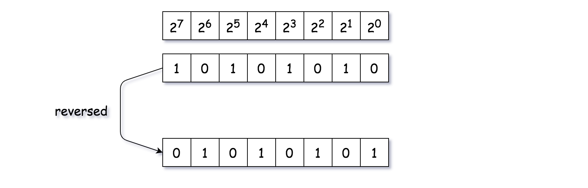

## 191. 位1的个数 [n & (n-1) 消除 n 最后一个1]
1. https://leetcode-cn.com/problems/number-of-1-bits/
2. 题目: 
+ 编写一个函数，输入是一个无符号整数，返回其二进制表达式中数字位数为 ‘1’ 的个数
+ 示例:
```
输入：00000000000000000000000000001011
输出：3
解释：输入的二进制串 00000000000000000000000000001011 中，共有三位为 '1'。
```

3. 思路:
+ n & (n - 1) 可以消除 n 最后的一个1的原理。
+ 不断进行n = n & (n - 1)直到n === 0, 说明没有一个1了。这个时候我们消除了多少1变成一个1都没有了， 就说明n有多少个1了。

4. 代码: 
```js
var hammingWeight = function(n) {
  let count = 0;
  while (n !== 0) {
    n = n & (n - 1);
    count++;
  }

  return count;
};
```
5. 刷题记录

|  时间   | 次数  | 备注  |   |
| :---- | :----: | :---- |:----: |
| 08.28  |   1  | n&(n-1) =>消除最后的一个1 | 1|


## 231. 2的幂
1. https://leetcode-cn.com/problems/power-of-two/
2. 题目: 
+ 给定一个整数，编写一个函数来判断它是否是 2 的幂次方。
+ 示例:
```
输入: 16
输出: true
解释: 24 = 16
```

3. 思路:
+ n > 0 且 n & (n - 1) == 0 

4. 代码: 
```js
/**
 * @param {number} n
 * @return {boolean}
 */
var isPowerOfTwo = function(n) {
  return n > 0 && (n & (n-1)) == 0;
};

```
5. 刷题记录

|  时间   | 次数  | 备注  |   |
| :---- | :----: | :---- |:----: |
| 08.28  |   1  | n&(n-1) | 1|


## 190. 颠倒二进制位
1. https://leetcode-cn.com/problems/reverse-bits/
2. 题目: 
+ 颠倒给定的 32 位无符号整数的二进制位。
+ 示例:
```
输入: 00000010100101000001111010011100
输出: 00111001011110000010100101000000
解释: 输入的二进制串 00000010100101000001111010011100 表示无符号整数 43261596，
     因此返回 964176192，其二进制表示形式为 00111001011110000010100101000000。
```

3. 思路:

+ 关键思想是，对于位于索引 i 处的位，在反转之后，其位置应为 31-i（注：索引从零开始）。
+ 我们从右到左遍历输入整数的位字符串（即 n=n>>1）。要检索整数的最右边的位，我们应用与运算（n&1）。
对于每个位，我们将其反转到正确的位置（即（n&1）<<power）。然后添加到最终结果。
当 n==0 时，我们终止迭代。

4. 代码: 
```js

```
5. 刷题记录

|  时间   | 次数  | 备注  |   |
| :---- | :----: | :---- |:----: |
| 08.28  |   1  | 位运算 | 1|


## 1122. 数组的相对排序  [计数排序]
1. https://leetcode-cn.com/problems/relative-sort-array/
2. 题目: 
+ 
+ 示例:
```
输入：arr1 = [2,3,1,3,2,4,6,7,9,2,19], arr2 = [2,1,4,3,9,6]
输出：[2,2,2,1,4,3,3,9,6,7,19]
```

3. 思路:
+ 将输入的数据值转化为键存储在额外开辟的数组空间中；
+ 然后依次把计数大于 1 的填充回原数组
  - 先把arr2出现的元素对应的键值依次取出
  - 最后把计数数组里剩余的数据依次取出


4. 代码: 
```js
var isAnagram = function(s, t) {
  if(s.length != t.length){
      return false;
  }
  var result = new Array(26);
  for(var i = 0;i<26;i++){
      result[i] = 0;
  }
  var aCode = 'a'.charCodeAt();
  for(var i = 0;i<s.length;i++){
      result[s[i].charCodeAt()-aCode]++;
      result[t[i].charCodeAt()-aCode]--;
  }
  for(var r = 0;r<result.length;r++){
      if(result[r]!=0){
          return false;
      }
  }
  return true;
};

```
5. 刷题记录

|  时间   | 次数  | 备注  |   |
| :---- | :----: | :---- |:----: |
| 08.22  |   1  |  | 1|

## 242. 有效的字母异位词 [计数排序 + 哈希表] [week4]
1. https://leetcode-cn.com/problems/valid-anagram/
2. 题目: 
+ 给定两个字符串 s 和 t ，编写一个函数来判断 t 是否是 s 的字母异位词。
+ 示例:
```
输入: s = "anagram", t = "nagaram"
输出: true

```
3. 思路:
+ 分别对其中一个单词每个字母出现的字符次数进行增加
+ 对另一给单词每个字母出现的次数进行减少
+ 维护一个26位的数组，且初始化为0，方便遍历时直接进行++，而不用判断是否存在
+ 最后遍历哈希结果数组只要有不为0的就是false


5. 刷题记录

|  时间   | 次数  | 备注  |   |
| :---- | :----: | :---- |:----: |
| 08.22  |   1  | 计数 | 1|

## 51. N皇后 [位运算] [!!!]
1. https://leetcode-cn.com/problems/n-queens/
2. 题目: 
+ 
+ 示例:
```

```

3. 思路:
+ 

4. 代码: 
```js

```
5. 刷题记录

|  时间   | 次数  | 备注  |   |
| :---- | :----: | :---- |:----: |
| 08.28  |   1  | 位运算 | 1|

## 146. LRU缓存机制
1. https://leetcode-cn.com/problems/lru-cache/#/


